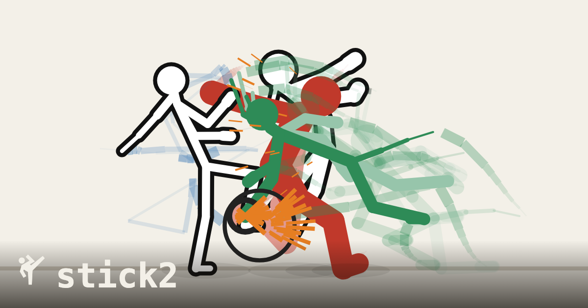
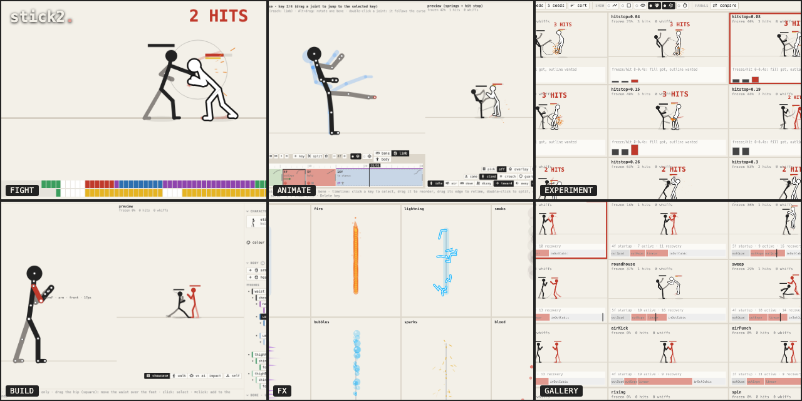
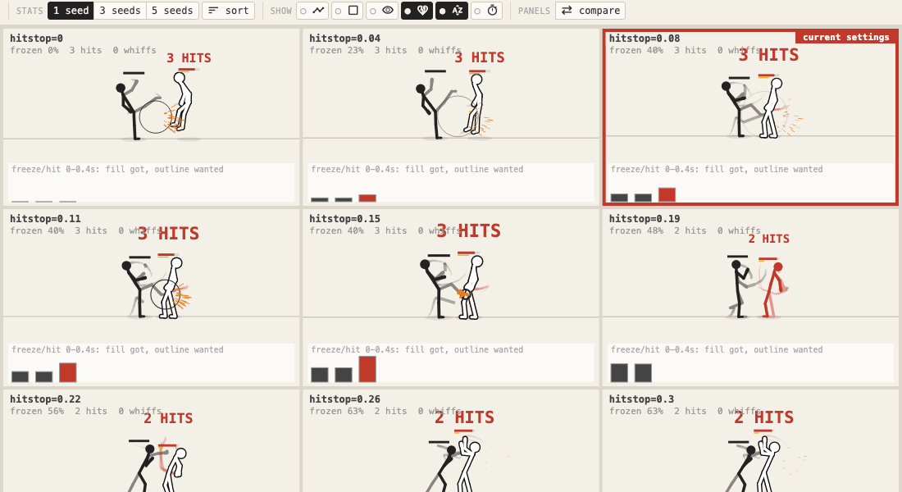
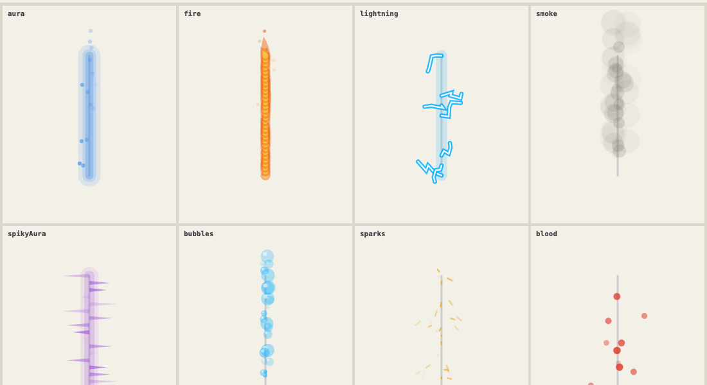

# stick2

A 2D stick-figure fighting engine and motion lab for the browser: procedural skeletons, keyframe tweening with a spring pose filter, and tools to tune how hits *feel*. No build step, no dependencies, no image assets: everything is drawn in code.

**[Play it on GitHub Pages](https://morbeo.github.io/stick2/)**, or open `index.html` directly. Full docs: [docs/](docs/README.md).

This is an active, solo-built project and it needs feedback and testers. If you try it, please [open an issue](https://github.com/morbeo/stick2/issues) with what felt wrong, what broke, or what was confusing — even a short note helps. Pull requests are welcome too; see [CONTRIBUTING.md](CONTRIBUTING.md).

## Try a scenario

A scenario is a fight already set up for you — who's fighting, who controls them, where they stand — picked with the **scenario** button (play and experiment tabs, grouped by who fights) or browsed in [grid](docs/modes.md#grid). Each link below opens it live, full-screen, no setup:

| Scenario | | |
|---|---|---|
| [you vs ai](https://morbeo.github.io/stick2/#embed=you%20vs%20ai) | Play against the engine AI. | *you* |
| [J,J,J](https://morbeo.github.io/stick2/#embed=J%2CJ%2CJ) | A jab chain into a launcher. | *chains* |
| [juggle](https://morbeo.github.io/stick2/#embed=juggle) | A combo into a launcher, then an air juggle. | *juggles & falls* |
| [parry](https://morbeo.github.io/stick2/#embed=parry) | A kick parried; the punch that follows lands clean. | *guard & counters* |
| [fireball](https://morbeo.github.io/stick2/#embed=fireball) | A projectile thrown across the stage. | *specials* |
| [ninja flip](https://morbeo.github.io/stick2/#embed=ninja%20flip) | A hop forward, then back, in the 2.5D belt plane. | *movement* |
| [weapon clash](https://morbeo.github.io/stick2/#embed=weapon%20clash) | Two drawn swords meeting mid-swing. | *weapons* |

Any scenario named anywhere in these docs plays the same way: `https://morbeo.github.io/stick2/#embed=<name>` (spaces and all, URL-encoded). It opens in [theater mode](docs/modes.md#theater-mode) — press Esc for the full interface, the scenario picker and every setting.

## Features

**Fight.** You, the engine AI (four difficulty levels), a dummy or scripted scenarios; 16 characters with chains, motion specials, throws, counters, projectiles, weapons, juggles and ragdoll falls; 2D or 2.5D lanes; endless waves. A frame meter and input display for training. → [Fighting](docs/fighting.md)

**Tune the feel.** Hundreds of settings (hit stop, shake, zoom, springs, gravity, knockback) with presets, and an experiment tab that replays the same seeded fight side by side with one setting swept.

**Browse everything.** The grid tab is a content manager: characters, moves, scenarios, sounds, looks and tracks as searchable tiles, with the variables you pick shown on each one; click a tile to open it where it's really edited. → [Modes: grid](docs/modes.md#grid)

**Design looks and sounds.** Fire, lightning, smoke, blood and more as tunable particle looks with a live preview; sounds synthesized live (no files) with a waveform preview; a tracker (step sequencer) built from them. → [Modes: fx](docs/modes.md#fx)

**Animate moves.** Pose keyframes by dragging joints (IK), retime them on a timeline, and watch the move with springs and hit stop against a target in any state. A gallery loops every move, a move table edits them all at once, and a combo tree links them into chains. → [Editing](docs/editing.md)

**Build characters.** Drag joints, add limbs (arms, legs, tails, heads), tune each bone's stretch, stiffness and follow-through; stances, idle and walk variety, a stat radar.

**Test moves.** Every move against every target: standing, crouching, guarding high or low, airborne, down, dizzy; facing or turned away; near or far. Cells that don't do what they should turn red; click one to watch it and open it in the editor. → [Modes: tests](docs/modes.md#tests)

**See the impacts.** Hit reactions and falls side by side; drag on a body to strike it anywhere, or strike one ragdoll alone with high, mid, low, sweep, launcher and more. → [Modes: impact](docs/modes.md#impact)

**Get around.** ⌘K finds any mode, tool, table, move or setting; every key rebinds, with macros; deterministic replays you can save, rewind and scrub; export and import a character, your settings or everything; in-app docs with live demos. → [Interface](docs/interface.md)

## Development

`npm test` runs the engine tests in Node; `npm run test:browser` runs the headless Chrome smoke test. → [Testing](docs/testing.md)

The only asset is `fonts/icons.woff2`, a subset of [Material Symbols](https://github.com/google/material-design-icons) (Apache 2.0); everything else, sound included, is generated in code.

## License

[MIT](LICENSE) © 2026 Vladimir Kirov. The icon font `fonts/icons.woff2` is a subset of [Material Symbols](https://github.com/google/material-design-icons) by Google, under the Apache License 2.0 ([fonts/LICENSE](fonts/LICENSE)).
