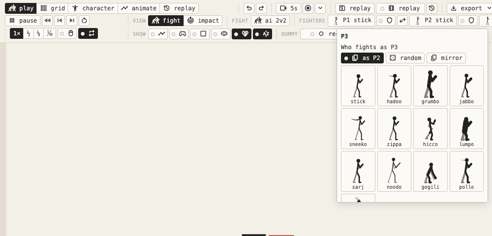
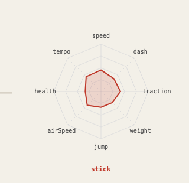
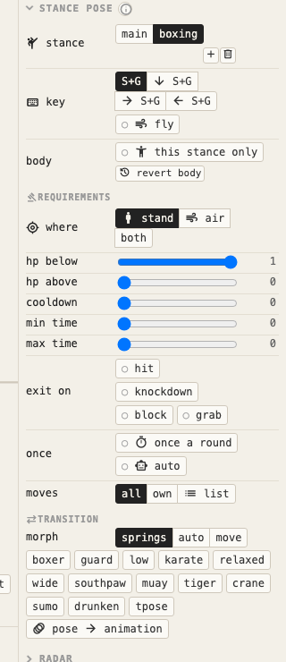
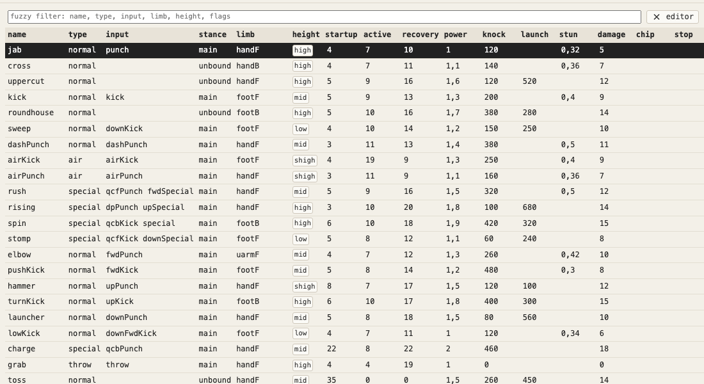
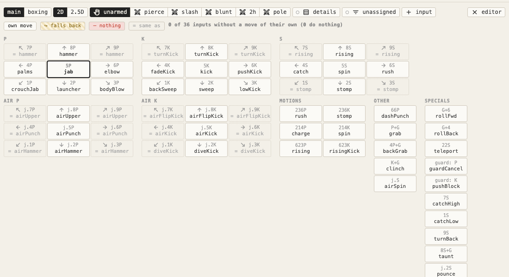
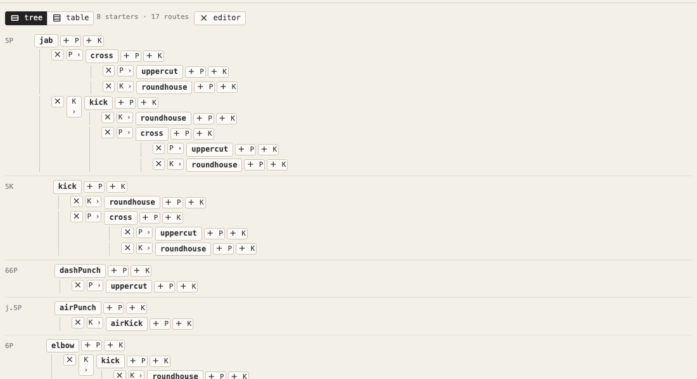

# Editing characters and moves

[← docs index](README.md)

Building fighters and their movesets. The editors themselves (dragging joints, the timeline) are on the [Modes](modes.md#character) page; this page is about what you build with them.

| Section | Where it is |
|---|---|
| [Characters](#characters) | side panel in character and animate |
| [Moves and inputs](#moves-and-inputs) | the move table over the stage |
| [Movement layers](#movement-layers) | animate → move group → + → layer |
| [Input table](#input-table) | the **moves** group → inputs |
| [Combos](#combos) | the **moves** group → combos |

## Characters

The character panel shows a grid of drawings, all at one scale.

| Every character, drawn at one scale |
| --- |
|  |

### The roster

**stick** is the plain base. The dozen others are stereotypes, each with signature moves bound to every input, motions, a second stance, stats and a gait:

| Character | Type | Signature moves |
|---|---|---|
| hadoo | the shoto | ki blast on S, rising uppercut, whirlwind kick on the floor and in the air |
| grumbo | the grappler | huge and slow: a spinning piledriver on a half circle, bear hug, spinning lariat |
| jabbo | the boxer | punches on K too, dash straight and upper, rush flurry, a bounce |
| sneeko | the ninja | double jump, shuriken on the floor and in the air, slide, vanishing kick, a scarf |
| zippa | the kicker | lightning legs, bird kick, head stomp, crane kick |
| hicco | the drunken master | sways and slides, a tipsy roll, a sway that catches a blow and strikes back |
| lumpo | the sumo | hundred slap, flying torpedo, belt throw, sumo splash |
| sarj | the soldier | sonic boom, flash kick, spinning knuckle, knee bazooka |
| noodo | the yogi | long limbs, yoga fire, drill kick, a warp, floaty |
| gogili | the beast | long arms, hunched, rolling ball, electricity, a bite |
| pollo | the luchador | giant swing, german suplex, dropkick, plancha, high jumps |
| gloomo | the boss demon | horns, wings, tail, four arms, dark orb, psycho dash, warp claw, skull dive |

### Your own

- **random** generates one: proportions, thickness, extra limbs, stance, stats. The sliders button tunes the generator; a grid of nine random characters lets you pick one to keep.
- **copy** to make your own; **rename**, **revert**, **export / import** as JSON.
- Edits are saved in the browser automatically. Only changed built-ins are stored, so a stored copy of an old built-in needs **revert** to get the new version.
- Any move can be bound to an input (J, K with any direction, running, air, motions), so copied moves are playable.

### Colour

By default a fighter is coloured by which player it is (P1 black, P2 red, P3 blue…), the same for every character. The **colour** row gives a character its own colour instead — a preset swatch or any colour from the picker — used everywhere it's drawn, in a fight too, overriding the player slot. **auto** goes back to the player-slot colour.

### Stats

Stats scale the fight settings for that character. Three groups, with group buttons and the body experiment:

| Group | Stats |
|---|---|
| ground | walk speed, dash speed, traction, turnaround, weight |
| air | jump height (whatever its gravity), max jumps (-1 = infinite air jumps), gravity, air speed, air acceleration, fall speed, air dodge, air dash |
| fight | health, toughness, tempo, springs, grab range |

The **radar** above the stats draws the chosen stats: each axis runs from the stat's minimum to its maximum, the dashed ring is 1. Other characters can be overlaid to compare.

| The stats radar |
| --- |
|  |

### Shadow

The **shadow** section (character tab, under walk & idle) sets the shadow drawn under the character in a fight. Drawing only: the fight plays out the same.

- **shape:** ellipse (the default oval), circle (a round blob, w is its radius), body (the figure itself squashed and sheared onto the floor) or **off**.
- **w, h:** the oval's half-width and half-height. For body, w / 22 and h / 22 scale the figure's width and height on the floor.
- **alpha** (darkness) and **colour** (black or an effect colour: a purple glow under a ghost).
- **dx, dy:** moves it from the feet. **lift:** how fast it shrinks as the fighter rises (0 = never). **skew** (body only): how far it leans.
- Only what differs from the default is saved (`shadow` in the character JSON), with group buttons to randomize or reset.

### Stance bodies

A stance can have its own body. Pick the stance under the stance pose and switch on **this stance only**:

- Bone edits (length, thickness, shape, effects, the other properties), new limbs and bones, stats, walk & idle and combo links then change that stance only. Off, they change the character in every stance.
- **Del** hides a bone in the stance (with everything below it): it isn't drawn, has no hurtbox and doesn't walk. The bone panel's **alpha** slider shows it again (drag it up from 0) — alpha also works outside stance editing, and between 0 and 1 the bone draws translucent but stays solid.
- **size** scales the whole body in the stance: every length, thickness and hurtbox.
- Health stays the character's. **revert body** throws the stance's body away.
- The editor and the preview show the stance picked. In a fight the switch keeps the running move; new bones grow in.
- In the character JSON: `stances[i].body = { bones: { id: { len, … , alpha } }, add: [bones], scale, stats, gait, chains: { move: next } }`. Only what differs is stored.
- **Main** (stance 0) can have a body of its own too, the same way: it becomes the character's actual body, and every other stance still varies from it as usual. In the JSON: `main.body`.

### Stance requirements

Under a stance's body row, **requirements** set when it can be taken and what ends it (unset: as before, on the ground, any time):

- **where:** on the ground (the default), in the air, or both. A press in the air waits for the ground as before.
- **hp below / hp above:** only with at most / at least this share of health left (a desperation stance at 0.3).
- **cooldown:** seconds after leaving it before it can be taken again. **min time:** seconds before it can be left. **max time:** seconds, then back to main on its own.
- **exit on:** hit, knocked down, blocking, grabbed: back to main.
- **once a round.**
- **auto:** no key needed — it is taken the moment the requirements above hold, and left the moment they stop holding (min time still applies).
- **moves:** all (its binds over main's), own (only its own binds), or a list of the moves it allows.
- A stance key whose stances are all blocked does nothing. In the JSON: `stances[i].req`, only what differs.

**Main** gets requirements too, picked the same way: where, hp, cooldown, min time, once a round and moves all gate a switch *back* into main. Max time, exit on and auto are left out — they send a stance back to main on their own, and main has nowhere else to go. In the JSON: `main.req`.

Next to the stance's key, **fly** makes it hover instead of fall: gravity and the ground are suspended while in it, and ↑ / ↓ fly up / down instead of jumping. Leaving the stance (a key, `exitOn`, `maxT`, or a hit) hands it back to normal gravity wherever it is. In the JSON: `stances[i].fly`; main can fly too, in `main.fly`.

### Stance transitions

**transition** (under the requirements) sets how the body changes switching to the stance, and back to main from it:

- **springs** (the default): the springs chase the new pose.
- **auto:** the stance pose and the bone lengths blend over **frames** (60 a second) with the **ease**. New bones grow from nothing, hidden ones shrink away.
- **move:** a keyframed transition move plays: `mainToCrane` switching into a stance named crane (or the move picked), `craneToMain` back to main. **new transition move** and **back** make them (half way between the two poses, then into the stance) and open them in animate. The move eases from wherever the body is, like any move; a switch forced by the stance's limits (max time, exit on) skips it.
- In the JSON: `stances[i].morph = { mode, T, ease, move }`, only what differs.

### In the air

- Every fighter gets air drift, a top fall speed with ↓ fast fall, an **air dodge** (G in the air: intangible; with a direction, a burst) and an **air dash** (double tap in the air), once per jump.
- **Super jump:** ↓ then jump. superJump × the launch speed, within superJumpWindow, from a longer squat.
- **Triangle jump:** a jump in the air next to a wall springs off it, up and away (wallJump, wallJumpPush, wallJumpReach). It gives back the air dodge and dash.

### Turning

- A fighter can't start a move until it has turned halfway (**turnSpeed**).
- While turning, the body is never thinner than **turnWidth** (0 = the old paper-thin flip through a profile, 1 = mirrored at once).
- **turnTuck:** the body gathers in as it turns: knees bend, arms pull in, the back hunches.

### Bodies

- A four-legged character kicks with its forelegs (knees forward); its hind legs bend like hocks.
- Fighters collide by their bodies' extent (torso and legs in the stance, behind and in front). Two four-legged characters keep their horse bodies apart, and the AI measures range from the body's front.

## Moves and inputs

Every direction × P / K can be a different move, Virtua Fighter style. The stick's set:

| Input | Move | Input | Move |
|---|---|---|---|
| 6P | elbow | 6K | push kick |
| 8P | hammer overhead | 8K | turn kick |
| 2P | launcher | 2K | sweep |
| 1P | crouch jab | 1K | back sweep |
| 3P | body blow | 3K | low kick |
| | | 4K | fade kick (steps back as it kicks) |
| 7P | backfist (2.5D) | 7K | crescent, an overhead (2.5D) |
| | | 9K | flying knee (2.5D) |

- **In the air**, ↑ and ↓ have their own moves: j.8P upper and j.8K flip kick launch, j.2P hammer spikes into a bounce, j.2K dives forward.
- **623K** is an invincible rising kick; **S in the air** a spinning kick.
- **↓↙← J** is charge: an unblockable palm strike with a long wind-up.
- Every input of the stick has a move. A diagonal without a move falls back to its vertical, then to neutral.
- The ninja adds 3K slide and 9K axe kick.
- The AI uses all of these, and mixes overheads and lows against a guard.

### Move properties

- **armor** (per key): the hit does damage but the move goes on.
- **counter hit:** a hit during the opponent's startup or active frames (counterHit: more damage and stun).
- **crumple** the victim, **wall** splat it, or **bounce** it off the floor.

### The move table

The **panels** group → **table** puts every move in a table over the stage: type, input, stance, limb, height, startup / active / recovery, power, knock, launch, stun, damage, chip, flags.

- Click a header to sort. The fuzzy filter matches any text column.
- Edit values in place. Editing frames retimes that phase's keys.
- Click a row to open the move in the keyframe editor; hover it to play the move next to the cursor.

## Movement layers

**animate → move group → + → layer.** Every movement state can get a keyframed layer on top of its procedural / IK motion.

**States:** crouch, rise, fall, flip, run, dash, backDash, backWalk, airDash, guard, hurt, tumble, lying, dizzy, turn.

- The layer is a move named after the state: **crouchLayer** (or **craneCrouchLayer** in a stance named crane).
- Its keys start at the state's procedural pose (its ref).
- In a fight, its keys play (looping) from the moment the state begins, and their offsets from the ref are added to the procedural pose.
- **mix** sets how much: 0 = off, 1 = as keyed. Back walk and turn fade in by speed, or by how far through the turn.
- Layers group as **layer** in the move picker. Delete one to go back.

## Input table

The **panels** group → **inputs**, or the controller button by a move's inputs.

A direction pad per button (P, K, S, air P, air K; numpad layout, 6 = toward the opponent), plus the motions and the other inputs. Above it, pick the moveset: the plane (2D / 2.5D), the stance, and the hand (unarmed or a weapon class).

| Pad looks | Meaning |
|---|---|
| plain | a move of its own |
| amber, ↪ | falls back to another move (shown) |
| red | does nothing |
| dotted, = | no slot of its own: plays another input |
| outlined | the move being edited |

- Click a pad or row to give it a move: the open one, the default, none, or any move. ⌘Z undoes.
- **details** opens a table of every input beside the pads, a split rather than a scroll down (the unassigned ones on request).
- **details:** the move an input plays has its startup, height, damage, power and stun edited in place. The move itself changes, so every input playing it changes too.
- **+ input** adds an input of your own: a motion in numpad notation plus P or K, e.g. `41236` = ←↙↓↘→ (↑ directions count too). It's kept with the character (motions) and tried before the built-in motions, longest first. Its row has a delete button; so does its pad's popup.

## Combos

The **panels** group → **combos**. The chain links, editable.

With the **chains** setting on authored, P, K or S in a move's cancel window chains into its next move. A link can also be on a direction held with the button, like 6P or 2K (→ is toward the foe). A direction without its own link falls back to the plain P / K / S one. S's directions are fwd / back / up / down only (diagonals count as their vertical, like a bind), not every direction like P and K.

### Tree

Every starter (a move bound to an input that has links, or one no move links to) with its input in numpad notation and its branches.

| Button | Does |
|---|---|
| ✕ | cuts a link |
| P › | changes it |
| + P / + K | adds one |
| ↺ | marks a link back into the route |
| + starter | starts a chain from a bound move without links |

### Table

One row per route from a starter to its end: its inputs, damage before combo scaling, and frames until the last move ends.

- Click a step to change or cut it.
- **+ P / + K** extends the route.

### Both views

- Hovering a move (a step in the table, a node in the tree) plays the combo up to it next to the cursor: each move until its cancel window opens, the last one to its end. Tooltips step aside, under or above it.
- A link offers the normals of the same kind (air with air, weapon with weapon), and a direction row: **·** for none, or an arrow. Picking one moves the link there.
- A warning with a button shows when the chains setting isn't authored.
- ⌘Z undoes.
