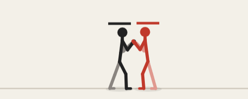
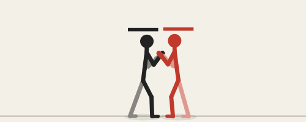
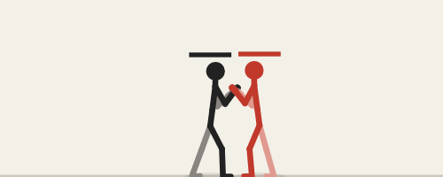
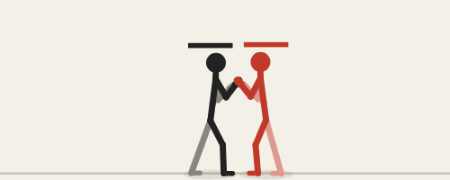
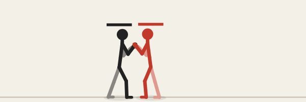
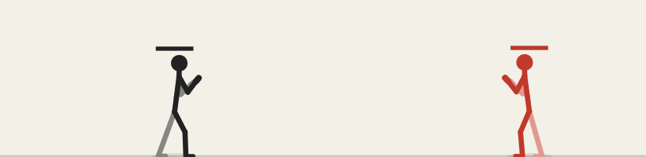
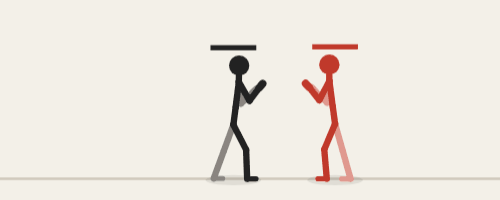

# Fighting

[← docs index](README.md)

The engine: how fights play, every system behind a setting group.

## Buttons, guard and damage

- **buttons, guard & damage**: P / K / S (special) / G (guard), U = S and L = G by default; S with a direction is a different special (S spin, → S rush, ↑ S rising, ↓ S stomp; slots in the editor); holding G guards against the front only (not from behind), ↓ + G is a low guard; tapping G just before a hit parries it (parryWindow) and staggers the attacker; heights high / special high / mid / special mid / low decide what each guard stops, highs pass over a crouching fighter; a move's **hits** (toggles in the move panel: stand / crouch / air, all by default; a lying foe is the otg flag's) leaves the other states alone, it passes through; **air guard** (airGuard setting, off by default): a jumping fighter holding G blocks every height, unless the move is flagged noAirGuard; **juggle points** (jugglePoints setting, 0 = no limit): each hit on a foe in the air or lying spends the move's juggle cost (1 unset) from the foe's pool, refilled when it is back on its feet, and a hit it can't pay for passes through (alongside juggleDecay); the move table shows hits, juggle and the flags; moves have damage, keys can be unblockable (the striking limb glows red while unblockable frames are coming), health bars over the heads, chip damage (per move or the chip setting), blockstun (light blue on the frame meter); per move hit stop (stop), blockstun (bstun) and block push (bpush) override the settings when set; a move's **range** is its setup distance, where the gallery, the animate preview and the Tests view put the target (45 px unset; long-reach moves like noodo's spin set more); KO and round reset; a heavy blow staggers (the fighter reels), damage fills a stun meter (yellow bar) and a full one makes the fighter dizzy (stars, orange on the meter) until the time runs out or a hit wakes it; scenarios vs guard / vs low guard / parry / specials (S)

| Parry: G tapped just before the blow | Just guard: G a little earlier, no chip |
| --- | --- |
|  |  |

## Combos and cancels

- **combos & cancels**: chains (authored routes, or a free 2-button magic series), specials by motion (↓↘→ J rush, →↓↘ J rising, ↓↙← K spin, ↓↘→ K stomp) that cancel normals on hit, jump cancels into air combos with juggle decay, a Capcom-style **chase jump** after a launcher (move flag launcher, the stick's 2P; chaseJump setting: press = ↑ held as it hits or after, auto = by itself, off): a jump at once up to the victim's height that steers to it for the air combo (scenario chase jump), OTG hits on a fighter lying down (the lie pose rests flat on the floor; with falls = pose it rolls to the angle it lies flattest at); cancel windows show purple on the frame meter and timeline (a key can open the window or be invincible); **cancel test** in the grid compares chain rules on combo fights
- **combo escalation**: hit stop, shake and zoom that grow per combo hit, attacks or the whole game speeding up (or slowing) along a combo; **combo fx test** in the grid shows each effect on the same air combo

| A chain: J, J, K |
| --- |
|  |

## Throws, counters and recovery

- **throws, counters & recovery**: J while holding guard (P+G) is a throw, K while holding guard (K+G) the second throw (throw2: clinch, into a suplex that lands the victim behind), ← held then P+G the back throw (backThrow: backGrab into backToss, whose key marked turn swings the held victim round, sliding, to land behind the thrower): a short reach that goes through guard but misses a crouching or airborne fighter; the victim is held for techWindow (the pair is not pushed apart while held, so neither slides) and breaks free with P+G (BREAK), else it is thrown down (the grab names its throw animation, toss); ← S is catch, a counter stance whose catch key answers a mid strike from the front with reversal (the key's catchH lists the heights it catches); a fighter knocked flying recovers in the air with G after airRecover, and G just before landing techs the fall into a quick get-up; lastFrame (on by default) lets a press on the tech window's last frame still break or tech (techWindow 0.25 = 15 frames gives 16 chances; off, exactly 15), compared side by side by **window edge test** in the grid; scenarios throw / back throw / throw break / catch / tech / air recover, and break / tech edge and inside (a press on the window's last frame, or one frame before); the AI throws standing guards, tries to break throws and sometimes techs

| Throw: P+G close | Throw break: P+G while held |
| --- | --- |
|  |  |

| Tech: G just before landing | Air recover: G in flight |
| --- | --- |
|  |  |

## Specials

- **specials** (Specials settings, each on its own switch; specialScheme picks the inputs: guard = G held + → / ← rolls, ↓↓ S teleports, ↖ S / ↙ S counter; motion = ↓↘→ S / ↓↙← S rolls, →↓↘ S teleports, ↓↓ S / ↙ S counter): **rolls** (rollFwd, rollBack; move flag roll) tumble through the foe or away from it, invincible and passing through fighters for rollInv; **teleport** reappears teleportDist behind the foe at its key marked warp, turned to face it, leaving after-images; **guard cancel** (guardCancel: P in blockstun, motion scheme → S) strikes back at once, invincible as it starts, for guardCancelCost health; **push block** (pushBlock: K in blockstun, motion scheme ← S) ends the blockstun with a shove that slides the attacker away (pushBlockForce); **just guard** (justGuard, Guard & damage): a guard tapped within justGuardWindow before the parry window blocks perfectly: blockstun × justGuardStun, no chip, no push (JUST); **wake-up** (wakeUp; any scheme): lying, P / K gets up attacking (getupAttack: a kick from the floor, invincible as it rises), → / ← gets up rolling that way, G held stays down up to wakeDelay longer; a knockdown lies downTime (Falls) before getting up; **counters by height** (counters): catchHigh catches a high or special-high strike and answers with highCounter (an elbow to the body), catchLow catches a low and answers with lowCounter (a stamp that knocks down), ← S stays the mid catch; a key's catch heights are toggles under catches in animate; **taunt** (taunt): ↑ S+G beckons the foe, open to any hit while it plays (off: ↑ S+G switches stance as S+G does); **win pose** (winPose): after a K.O. the controllers pause and each fighter still standing plays its win move; **pounce** (pounce): ↓ S in the air dives onto a fighter lying on the floor (pounce hits off the ground and lands into its strike; a key's drop drives it down); **turnaround** (turnBack: ↗ S in both schemes): turns the back to the foe (its key marked turn); back turned (away) the fighter cannot guard a hit from the front, ←, → or ↑ or a move without turns faces the foe again (↓ crouches with the back still turned) (a move first snaps round), a hit taken mid spin leaves it back turned, a get-up faces again; **wall bounce** (move flag wallbounce, on spin): the victim bounces back off the wall at wallBounceSpeed, popped up, its juggle count reset for a follow-up; all are moves edited in animate (a negative lunge moves back), the input table's specials pad shows the scheme's inputs; the AI rolls through some attacks, teleports from range, sometimes guard cancels or push blocks, catches a high or low it sees coming with the matching counter, taunts a foe lying far off, sometimes pounces on one lying near, and picks a wake-up as often as it techs; scenarios roll through / roll back / teleport / guard cancel / push block / just guard / wake-up attack / wake-up roll / high counter / low counter / taunt / win pose / pounce / wall bounce / turnaround

## Strikes

- **head, tail and two-limb strikes**: ↗ J headbutt, ← J palms (both hands strike), ← K a scorpion tail thrust for gloomo; any move can name one or several striking bones
- **turning moves** (key flag turn, animate's turn / spin toggles): turn = the fighter turns around during that key, its face sweeping through the profile in the key's time; spin (turn: 2) = a whole turn in the key, back showing halfway, so spinning moves (spin, turnKick, spinElbow, armada and the new spinKick, a spinning heel kick) wind up through their back and strike facing; one turn leaves the back to the foe (turnaround), and with a throw victim held it swings the victim to the other side (back throw)
- **projectiles** (shots setting; key flag shoot, animate's shoot toggle and shot row: look ki / fire / dark / wave / star, speed, size, life): as the shoot key is reached the move's shot leaves from between its striking limbs and flies straight; it hits with the move's own power, damage, height and stun, is blocked from the side it comes from (a counter can't catch it, the shooter gets no hit stop), meets a foe's shot and both cancel, and fizzles at the walls or when its life runs out; one shot per fighter at a time; the boxes view rings its hitbox; the stick's library has fireball (both palms pushed out); scenarios fireball / fireball clash
- **rising and multi-hit keys** (key panel: rise slider, rehit toggle): a key with rise lifts the fighter off the floor as it starts (rise = upward speed), so a ground move plays on through the air and lands (hadoo's shoryu, sarj's flash kick, zippa's bird kick, lumpo's torpedo); a key with rehit lets the move hit again whoever it already hit, for multi-hits (zippa's lightning legs, lumpo's hundred slap); scenarios flash kick / lightning legs (a scenario's chars names the characters it plays with)

| A projectile: the fireball |
| --- |
|  |

## Weapons

- **weapons** (Weapons settings: weapon none / random / one type, weaponStart floor / held, disarm, throwSpeed, throwCharge, throwChargeT): dagger, sword, axe, bat, nunchucks (the outer stick flails on a loose joint), war hammer and staff, drawn in wood and metal; a weapon is an extra bone in the front hand, compiled per character and weapon (armed); P+G over a lying one plays pickUp (the weapon slides and turns on the floor so its handle meets the front hand as the key marked grip is reached, then it is held), P+G while holding it plays weaponThrow (an overhand arm swing, the weapon leaves the hand at the key marked release; keep P+G held and the wind-up holds while the throw charges (the weapon glows), up to throwCharge × speed, spin, damage and knockback after throwChargeT seconds (POWER); the AI sometimes holds it too; it flies, hits its thrower's foes once along its whole drawn length (a staff behind the grip too), then drops); both are weapon moves edited in animate, the key flags grip / release (unmarked: the first key); a knockdown or a blow of at least disarm power knocks it loose; while held, P / → P / ↓ P play its class's moves (one-handed pierce: stab / lungeStab / riseStab, slash: slash / chop / lowSlash, blunt: swing / smash / lowSwing, two-handed: heavySwing / slam / groundSwing, pole: poke / whirl / trip), the whole weapon strikes (a staff behind the hand too) and a swing sweeps the ground it covers between substeps, so a fast whirl can't skip over a body, a staff or war hammer is held in both hands (grip2: the back hand holds it that far along from the front hand, two-bone IK, letting go where it can't reach), the staff pokes level, whirls a full circle into a high strike (a weapon spun whole turns isn't unwound after) and sweeps low, heavier weapons hit harder and swing slower; in animate weapon moves group as weapon and are edited in the hand of their class's weapon, binding one rebinds it for that class (wbinds); the AI picks weapons up and sometimes throws them; scenarios pick up & slash / weapon throw / disarm / sword vs staff ai / weapons ai. A weapon is never hurt (hits on it pass through to the body), but it clashes (clash setting: off / weapons / all): two active strikes that meet, one of them a weapon, cancel each other and both fighters recoil apart (clashStun, clashPush), and an active strike bats a thrown weapon away; scenarios weapon clash / deflect. Strikes resolve after every fighter has moved, so strikes in the same frame meet, and blows that land on the same frame all hit (a trade: both fighters are struck, a strike beats a throw), whatever the order of the fighters. The boxes view shows held weapons in amber and flying ones in red

## Power

- **power presets** (settings panel, under Presets): normal, heavy, smash and pinball set only the hit and bounce settings (powerScale, hitstop, floorBounce, bounces, wallBounce, ceiling, floorGrip): from the defaults to blows that send bodies across the screen, bouncing off the floor, walls and ceiling; the button of the matching set shows as on
- **power scale**: one setting that makes every hit more (or less) impactful: knockback, launch, hit stop and screen shake

## Falls

- **falls**: knocked-down fighters become a **ragdoll** (falls setting): the joints are point masses joined by the bones, with gravity, floor friction (floorGrip), wall splats and bounces, joint limits and a little muscle **tone** pulling toward the fall pose (on its back, arms by its sides), which lets go within a few tenths of a second once the body is on the floor (at once for a K.O.), so it lies limp; even a fully limp body (tone 0) keeps some slack in its knees and elbows, so it lies bent rather than straight; the hit's push lands mostly near the point of impact (topple), so a kick to the head tips the body over and a sweep takes the legs. falls: pose keeps the older keyframed fall, which bounces off the floor (restitution, bounce count) and off the arena walls. ceiling makes the top of the screen bounce a body back down (0 = none); the ragdoll bounces off the floor as a whole bounces times

| Wall bounce |
| --- |
|  |

## Body and movement

- **foot planting** (Feet settings: plant, plantStep, plantStepT, plantLift; off by default): a foot the animation puts on the floor stays where it landed while the body moves over it, the leg bending to reach it (two-bone IK, the knee bending the way the animation bends it); a foot left more than plantStep from where the animation wants it takes a step there (lifted, one foot at a time), a foot the animation lifts (kicks, the walk's swinging leg) follows the animation; drawing and hit tests use the planted legs
- **idle and walk variety**: each fighter gets its own stance width and idle (weight shift, boxer bounce or sway); steps match leg length so feet stay planted, walking back takes shorter steps with the guard up, a four-legged character trots on diagonal pairs; **walk & idle** in character tunes stride, lift, arm swing, lean, the idle style and amount and breathing (group buttons, experiment), and **+ idle loop / + walk loop** in animate turn the procedural cycle into keyframes to edit like a move (a move named idle or walk replaces the procedural one, craneIdle / craneWalk in a stance named crane; delete it to go back)

## Planes: 2D and 2.5D

- **2D / 2.5D** (plane setting): one line, three sidestep lanes (double tap ↑ / ↓; wide moves like spin still hit) or a free depth belt (↑ / ↓ walk in depth); fighters are drawn lower and bigger toward the camera; flat figures only hit within zReach of each other's depth, and attacks home in on the target's depth (zAssist); separate movesets: in 2D ↑ jumps (↑ pressed with P / K turns the jump squat into an up attack) and the air has ↑ / ↓ moves of its own; in 2.5D (VF-style) ↑ is a direction with its own moves (9P headbutt) and Space jumps; the animate panel's input row edits the binds of either (2D / 2.5D); Space jumps in every plane, with ← / → a ninja flip; double tap → / ← dashes (passing through opponents for the first dashPass seconds, and on through a body it is already inside while the dash lasts, so a dash crosses a foe backed against the wall; two fighters level at a wall are pushed apart by which way they move or face, and never into it), holding on runs; the AI lines up in depth and sidesteps; **2.5D test** in the grid runs every plane on sidestep / flip / dash / AI fights

## Stances and styles

- **stances**: a stance's key switches to it (S+G, ↓ S+G, → S+G or ← S+G, picked under the stance buttons; pressed again it goes back to main, stances sharing a key take turns; saved K+G keys become S+G); every built-in has a second stance in a fighting style with that style's moves: stick boxing, hadoo karate, grumbo wrestling, jabbo peekaboo, sneeko shadow, zippa crane (on one leg with kicks from the raised knee), hicco sober (upright kung fu), lumpo shikiri, sarj turtle (crouched holding the charge), noodo tree, gogili prowl, pollo lucha, gloomo menace; each stance has its own pose, its own binds over the main ones and its own idle / walk loops, edited by picking the stance above the stance pose (character) or the move list (animate), where **group: stance** (and the table's stance column) shows which moves each stance adds; more preset poses (southpaw, muay thai, tiger, crane, sumo, drunken)
- **fighting-style moves** (unbound, give them an input in the input table): boxing hook, bodyHook, overhand; karate reversePunch, sideKick, knifeHand; muay thai plum (the Thai clinch: a throw that releases into a knee), spinElbow, thaiKick (low); capoeira armada (spinning, wide), martelo, rasteira (low sweep from the floor); kung fu chainPunch (three alternating straight punches), tigerClaw (both hands); taekwondo axeKick (overhead, bounces the victim); wrestling lariat (running), clinch (a throw into a suplex that lands the victim behind); every built-in move carries its style, so group: style shows each style's whole set
