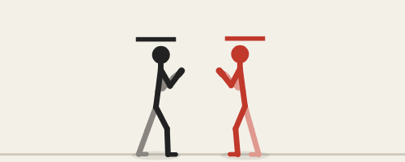
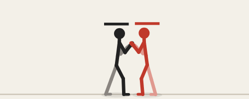
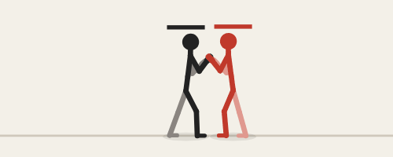
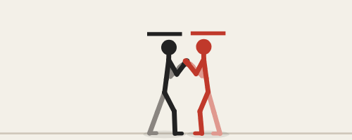
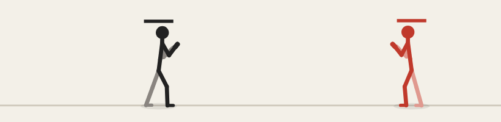
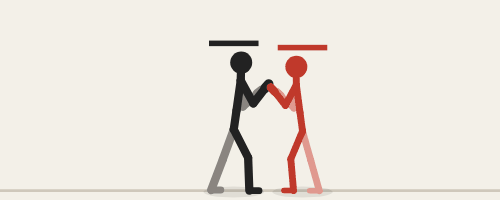
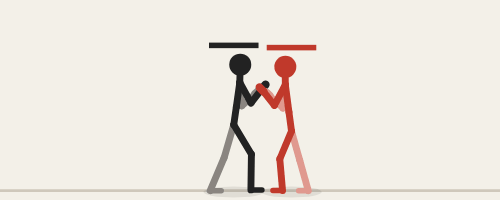
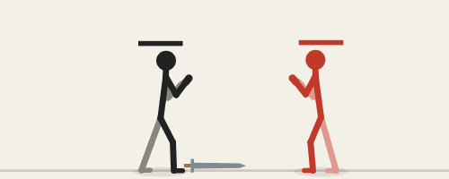
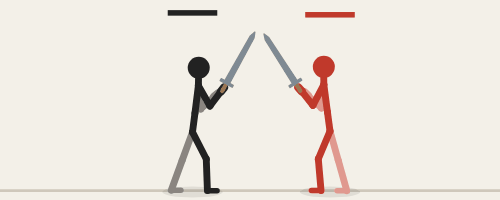

# Fighting

[← docs index](README.md)

How fights play. Each system here has its own setting group in the side panel.

| Section | What's in it |
|---|---|
| [Buttons, guard and damage](#buttons-guard-and-damage) | P / K / S / G, guard, parry, heights, juggles, stun |
| [Combos and cancels](#combos-and-cancels) | chains, motion specials, chase jump, OTG, escalation |
| [Throws, counters and recovery](#throws-counters-and-recovery) | throws, breaks, catch, air recover, tech |
| [Specials](#specials) | rolls, teleport, guard cancel, push block, wake-up, taunt… |
| [Strikes](#strikes) | headbutts, tails, turning moves, projectiles, rising and multi-hit keys |
| [Weapons](#weapons) | picking up, throwing, weapon moves, clashes |
| [Power](#power) | power presets and power scale |
| [Cinema](#cinema) | slow motion, camera, punch-in, knockback scale, film effects |
| [Falls](#falls) | ragdoll and pose falls |
| [Body and movement](#body-and-movement) | foot planting, idle and walk |
| [Planes: 2D and 2.5D](#planes-2d-and-25d) | lanes, depth, dashes |
| [Stances and styles](#stances-and-styles) | second stances, fighting-style moves |

## Buttons, guard and damage

### Buttons

| Button | Default key | Does |
|---|---|---|
| P | J | punch |
| K | K | kick |
| S | U | special |
| G | L | guard |

S with a direction is a different special. The motions below play the stick's other four (rush, rising, spin, stomp). The slots are in the editor.

| Input | Special |
|---|---|
| S | palm shot: a ki ball off one palm |
| → S | shoulder charge: shrugs off a hit as it winds up (armor), bounces the foe off a wall |
| ↑ S | jump kick: a leaping flying side kick |
| ↓ S | ground punch: down on one knee into the floor, hits a foe lying there |

### Guard

- **Hold G** to guard against the front only, not from behind. **↓ + G** is a low guard.
- **Parry:** tap G just before a hit (parryWindow). It staggers the attacker.
- **Heights:** high, special high, mid, special mid, low. Each decides what each guard stops; highs pass over a crouching fighter.
- **hits:** toggles in the move panel for stand, crouch and air (all on by default). The move passes through a state that's off. A lying foe is the otg flag's job.
- **Air guard** (airGuard setting, off by default): a jumping fighter holding G blocks every height, unless the move is flagged noAirGuard.

| Parry: G tapped just before the blow | Just guard: G a little earlier, no chip |
| --- | --- |
|  |  |

### Juggle points

**jugglePoints** (0 = no limit) works alongside juggleDecay:

- Each hit on a foe in the air or lying spends the move's **juggle** cost (1 unset) from the foe's pool.
- The pool refills when the foe is back on its feet.
- A hit the foe can't pay for passes through.

The move table shows hits, juggle and the flags.

### Damage

- Moves have **damage**. Health bars sit over the heads.
- **Unblockable** keys: the striking limb glows red while unblockable frames are coming.
- **Chip damage:** per move, or the chip setting.
- **Blockstun** shows light blue on the frame meter.
- **Per-move overrides:** hit stop (stop), blockstun (bstun) and block push (bpush) replace the settings when set.
- K.O. and round reset.

### Range and reach

- **range:** the move's setup distance, where the gallery, the animate preview and the Tests view put the target. 45 px unset; long-reach moves like noodo's spin set more.
- **reach:** widens the strike by that many px around the striking joint. flyingKnee has 6, so the knee lands on a wide body.

### Stagger and dizzy

- A heavy blow **staggers**: the fighter reels.
- Damage fills a **stun meter** (yellow bar). A full one makes the fighter **dizzy** (stars, orange on the meter) until the time runs out or a hit wakes it.

**Scenarios:** vs guard, vs low guard, parry, specials (S).

## Combos and cancels

### Ways to combo

- **Chains** (setting): **authored** plays only the routes a move's own **next** links name — P / K / S, or a direction held with it (6P, or fwdSpecial / backSpecial / upSpecial / downSpecial for S); **free** drops the authored routes and lets any move that hit chain into any other move not yet used this combo (a magic series); **none** turns chaining off (jump cancels, OTG and special-by-motion cancels still work).
- A move's own **cancel** (move panel) sets which key opens its cancel window; unset, the window opens right after its last active key. This applies under every chains setting.
- **specialCancel** (setting) lets a hit normal cancel into any special the fighter can play, once its cancel window is open — this works even under chains: none, and even for a move with no **next** links of its own.
- **Specials by motion** cancel normals on hit:

| Motion | Special |
|---|---|
| ↓↘→ J | rush |
| →↓↘ J | rising |
| ↓↙← K | spin |
| ↓↘→ K | stomp |

- **Jump cancels** into air combos, with juggle decay.
- **OTG hits** on a fighter lying down. The lie pose rests flat on the floor; with falls = pose it rolls to the angle it lies flattest at.
- **Cancel windows** show purple on the frame meter and the timeline. A key can open the window, or be invincible.

### Chase jump

A Capcom-style jump after a **launcher** (move flag launcher; the stick's 2P). It jumps at once up to the victim's height and steers to it for the air combo.

| chaseJump | Triggers |
|---|---|
| press | ↑ held as it hits, or after |
| auto | by itself |
| off | never |

Scenario: chase jump.

| The chase jump: a launcher followed up at once |
| --- |
|  |

### Combo escalation

Hit stop, shake and zoom that grow with each combo hit; attacks, or the whole game, speeding up (or slowing) along a combo.

### In the grid

- **cancel test** compares chain rules on combo fights.
- **combo fx test** shows each escalation effect on the same air combo.

| A chain: J, J, K |
| --- |
|  |

## Throws, counters and recovery

### Throws

| Input | Throw |
|---|---|
| P+G (J while holding guard) | throw |
| K+G (K while holding guard) | throw2: clinch, into a suplex that lands the victim behind |
| ← held, then P+G | backThrow: backGrab into backToss |

- A throw has short reach. It goes through guard but misses a crouching or airborne fighter.
- The grab names its throw animation, **toss** (a move: `m.throw`), which the THROWER plays (the victim hangs in a generic hurt pose, pinned in front of it); its damage lands on the victim once the hold ends.
- **backToss**'s key marked **turn** swings the held victim round, sliding, to land behind the thrower.
- **Aimed throws:** ← held as the grab actually connects (not just at the press) throws the victim behind instead, whichever grab move caught them — so a plain forward grab can still come out as a back throw if you hold back in time. Forward or neutral keeps the regular toss.
- The victim is held for **techWindow**. The pair isn't pushed apart while held, so neither slides.
- **Break:** the victim presses P+G in time to break free (BREAK). Otherwise it's thrown down.
- Any move can be a custom throw: in animate, the move panel's **throw** row picks which of the character's moves the thrower plays (**new toss move** makes one, starting from the built-in toss, and opens it). A throw move needs no active keys of its own. Bind it to any input, same as a strike.
- **inputLeniency** setting: guard doesn't need to land on the exact same frame as the button — held, or pressed up to this long before it, still throws (S+G likewise, for taunt and stance switches). 0 is the exact same frame, as before.

### Catch

**← S** is catch, a counter stance. Its catch key answers a mid strike from the front with **reversal**. The key's **catchH** lists the heights it catches. Any move can catch: a key's **catch** flag, and the move panel's **counter** row picks which move answers (**new counter move** makes one, starting from the built-in reversal, and opens it) — its damage lands on the attacker at once.

| Catch: ← S answers a mid strike with reversal |
| --- |
|  |

### Recovery

- **Air recover:** a fighter knocked flying recovers in the air with G, after airRecover. ← / → held aims the recovery burst that way; unheld it just damps the existing momentum and pops up.
- **Tech:** G just before landing turns the fall into a quick get-up. ← / → held as it lands sends it that way; unheld it recovers back and away from the foe, as before.

### The window's last frame

**lastFrame** (on by default) lets a press on the tech window's last frame still break or tech. techWindow 0.25 = 15 frames gives 16 chances; with lastFrame off, exactly 15. **window edge test** in the grid compares them side by side.

**Scenarios:** throw, back throw, throw break, catch, tech, air recover; break / tech edge and inside (a press on the window's last frame, or one frame before).

**AI:** throws standing guards, tries to break throws and sometimes techs.

| Throw: P+G close | Throw break: P+G while held |
| --- | --- |
|  |  |

| Tech: G just before landing | Air recover: G in flight |
| --- | --- |
|  |  |

## Specials

The Specials settings have a switch for each one. All of them are moves edited in animate; a negative lunge moves back. The input table's specials pad shows the current scheme's inputs.

### Inputs

**specialScheme** picks the inputs:

| Special | guard scheme | motion scheme |
|---|---|---|
| rolls | G held + → / ← | ↓↘→ S / ↓↙← S |
| teleport | ↓↓ S | →↓↘ S |
| counter | ↖ S / ↙ S | ↓↓ S / ↙ S |
| guard cancel | P in blockstun | → S |
| push block | K in blockstun | ← S |
| turnaround | ↗ S | ↗ S |

### Moving

- **Rolls** (rollFwd, rollBack; move flag roll): tumble through the foe or away from it, invincible and passing through fighters for **rollInv**.
- **Teleport:** reappears **teleportDist** behind the foe at its key marked **warp**, turned to face it, leaving after-images.

| Roll: tumbles through the foe, invincible | Teleport: reappears behind the foe, after-images |
| --- | --- |
|  |  |

### Defending

- **Guard cancel** (guardCancel): strikes back at once from blockstun, invincible as it starts, for **guardCancelCost** health.
- **Push block** (pushBlock): ends the blockstun with a shove that slides the attacker away (**pushBlockForce**).
- **Just guard** (justGuard, in Guard & damage): a guard tapped within **justGuardWindow** before the parry window blocks perfectly: blockstun × **justGuardStun**, no chip, no push on the defender (JUST) — and **justGuardKnock** pushes the attacker back.
- **Counters by height** (counters):
  - **catchHigh** catches a high or special-high strike and answers with **highCounter**, an elbow to the body.
  - **catchLow** catches a low and answers with **lowCounter**, a stamp that knocks down.
  - ← S stays the mid catch.
  - A key's catch heights are toggles under **catches** in animate.

| Guard cancel: strikes back from blockstun | Push block: shoves the attacker away |
| --- | --- |
|  |  |

### Getting up

**Wake-up** (wakeUp; any scheme), while lying:

| Input | Wake-up |
|---|---|
| P / K | gets up attacking (getupAttack: a kick from the floor, invincible as it rises) |
| → / ← | gets up rolling that way |
| G held | stays down up to **wakeDelay** longer |

A knockdown lies **downTime** (Falls) before getting up.

| Wake-up attack: a kick from the floor | Wake-up roll: rolls up and away |
| --- | --- |
|  |  |

### Showing off

- **Taunt** (taunt): ↑ S+G beckons the foe. It's open to any hit while it plays. Off: ↑ S+G switches stance, as S+G does.
- **Win pose** (winPose): after a K.O. the controllers pause and each fighter still standing plays its **win** move.

| Taunt: ↑ S+G beckons the foe | Win pose: the survivor's victory move |
| --- | --- |
|  |  |

### Attacking

- **Pounce** (pounce): ↓ S in the air dives onto a fighter lying on the floor. pounce hits off the ground and lands into its strike; a key's **drop** drives it down.
- **Wall bounce** (move flag wallbounce, on spin and the shoulder charge): the victim bounces back off the wall at **wallBounceSpeed**, popped up, its juggle count reset for a follow-up.

| Pounce: ↓ S in the air dives onto a downed foe |
| --- |
|  |

### Turnaround

**turnBack** (↗ S in both schemes) turns the back to the foe, at its key marked **turn**.

- Back turned (away), the fighter can't guard a hit from the front.
- ←, → or ↑, or a move without turns, faces the foe again; a move snaps round first. ↓ crouches with the back still turned.
- A hit taken mid spin leaves it back turned. A get-up faces again.

| Wall bounce |
| --- |
|  |

### The AI

- rolls through some attacks
- teleports from range
- sometimes guard cancels or push blocks
- catches a high or low it sees coming with the matching counter
- taunts a foe lying far off, and sometimes pounces on one lying near
- picks a wake-up as often as it techs

**Scenarios:** roll through, roll back, teleport, guard cancel, push block, just guard, wake-up attack, wake-up roll, high counter, low counter, taunt, win pose, pounce, wall bounce, turnaround.

## Strikes

### Heads, tails and two limbs

- **↗ J** headbutt.
- **← J** palms: both hands strike.
- **← K** a scorpion tail thrust, for gloomo.
- Any move can name one or several striking bones.

### Turning moves

Key flag **turn**; the **turn** / **spin** toggles in animate.

- **turn:** the fighter turns around during that key, its face sweeping through the profile in the key's time.
- **spin** (turn: 2): a whole turn in the key, the back showing halfway. Spinning moves (spin, turnKick, spinElbow, armada and spinKick, a spinning heel kick) wind up through their back and strike facing.
- One turn leaves the back to the foe (turnaround). With a throw victim held, it swings the victim to the other side (back throw).

### Projectiles

The **shots** setting; key flag **shoot**; in animate the shoot toggle and the shot row (look: ki, fire, dark, wave, star; speed, size, life).

- As the shoot key is reached, the move's shot leaves from between its striking limbs and flies straight.
- It hits with the move's own power, damage, height and stun.
- It's blocked from the side it comes from. A counter can't catch it, and the shooter gets no hit stop.
- Two shots that meet cancel each other.
- It fizzles at the walls, or when its life runs out.
- One shot per fighter at a time.
- The boxes view rings its hitbox.
- The stick's S is **palmShot** (one palm). Its library also has **fireball** (both palms pushed out).

Scenarios: fireball, fireball clash.

| A projectile: the fireball |
| --- |
|  |

### Beams

The **beams** setting; key flag **beam**; in animate the beam toggle and the beam row (look: laser; width, range, duration).

- As the beam key is reached, a straight line holds out from between the striking limbs, as far as its range.
- It hits once, the moment it touches a foe, with the move's own power, damage, height and stun; it keeps showing for the rest of its duration.
- It's blocked from the side it comes from. A counter can't catch it, and the fighter holding it out gets no hit stop.
- One beam per fighter at a time. Unlike a shot, two beams don't cancel each other.
- The boxes view rings its hitbox.
- The stick's library has **laserBeam** (both palms pushed out, a beam between them), not bound to a key by default.

Scenario: laser beam.

| A beam: the laser |
| --- |
|  |

### Charging

Key flag **charge**; move field **charge** (dur, timeout, min, max); in animate the charge toggle and the charge row.

- The move holds at its charge key while its button stays held, the striking limbs glowing brighter as it powers up.
- **dur** is the seconds held to reach full power; **timeout** is the most it can be held before it fires anyway, at whatever charge it reached.
- **min** and **max** are the power multiplier at no charge and at full charge: they scale damage, knockback, and a shot or beam's size, speed or reach.
- A plain tap fires at the **min** multiplier — unheld, the move plays exactly as it would without charge.
- The stick's **fireball** and **laserBeam** are chargeable.

### Rising and multi-hit keys

In the key panel: the **rise** slider and the **rehit** toggle.

- **rise** lifts the fighter off the floor as the key starts (rise = upward speed), so a ground move plays on through the air and lands: hadoo's shoryu, sarj's flash kick, zippa's bird kick, lumpo's torpedo.
- **rehit** lets the move hit again whoever it already hit, for multi-hits: zippa's lightning legs, lumpo's hundred slap.

Scenarios: flash kick, lightning legs. A scenario's **chars** names the characters it plays with.

| Flash kick: rise carries the move into the air | Lightning legs: rehit lands a multi-hit move again |
| --- | --- |
|  |  |

### Stretching, thickening and fading bones at a key

Key fields **len**, **thick**, **alpha** (each `{boneId: multiplier}`); in animate the key panel's **stretch**, **girth** and **fade** rows pick the bones and the multiplier.

- **stretch** (len) multiplies a bone's length toward this key, 1 = normal. It eases in from the key before and back out after, just like a pose. A stretched bone also reaches further and its hurtbox grows with it, so a punch down a stretched arm actually lands from range — a Dhalsim limb.
- **girth** (thick) multiplies how thick a bone draws. **fade** (alpha) multiplies how visible it is, 0 = invisible. Both are drawing only; they don't change reach or the hurtbox.
- A bone's whole chain beyond the stretched one moves with it (the forearm stretching also carries the hand), since length feeds forward kinematics like any other bone property.

## Weapons

### Settings

| Setting | Does |
|---|---|
| weapon | none, random, or one type |
| weaponStart | on the floor, or held |
| disarm | the blow power that knocks a weapon loose |
| throwSpeed | how fast a thrown weapon flies |
| throwCharge, throwChargeT | the charged throw's bonus, and how long it takes |

### The weapons

Dagger, sword, axe, bat, nunchucks (the outer stick flails on a loose joint), war hammer and staff, drawn in wood and metal.

- A weapon is an extra bone in the front hand, compiled per character and weapon (armed).
- Heavier weapons hit harder and swing slower.
- A staff or war hammer is held in both hands. **grip2:** the back hand holds it that far along from the front hand (two-bone IK), letting go where it can't reach.

### Picking up and throwing

- **P+G over a lying weapon** plays **pickUp**. The weapon slides and turns on the floor so its handle meets the front hand as the key marked **grip** is reached; then it's held.
- **P+G while holding it** plays **weaponThrow**, an overhand arm swing. The weapon leaves the hand at the key marked **release**.
- **Charge:** keep P+G held and the wind-up holds while the throw charges (the weapon glows). After throwChargeT seconds, speed, spin, damage and knockback are up to throwCharge × (POWER). The AI sometimes holds it too.
- A thrown weapon flies, hits its thrower's foes once along its whole drawn length (a staff behind the grip too), then drops.
- pickUp and weaponThrow are weapon moves edited in animate. Unmarked grip / release means the first key.
- A knockdown, or a blow of at least **disarm** power, knocks the weapon loose.

| Picking up a sword, then slashing |
| --- |
|  |

### Weapon moves

While held, P / → P / ↓ P play its class's moves:

| Class | P | → P | ↓ P |
|---|---|---|---|
| one-handed pierce | stab | lungeStab | riseStab |
| one-handed slash | slash | chop | lowSlash |
| one-handed blunt | swing | smash | lowSwing |
| two-handed | heavySwing | slam | groundSwing |
| pole | poke | whirl | trip |

- The whole weapon strikes, a staff behind the hand too.
- A swing sweeps the ground it covers between substeps, so a fast whirl can't skip over a body.
- The staff pokes level, whirls a full circle into a high strike (a weapon spun whole turns isn't unwound after) and sweeps low.
- In animate, weapon moves group as **weapon** and are edited in the hand of their class's weapon. Binding one rebinds it for that class (wbinds).

### Clashes

A weapon is never hurt: hits on it pass through to the body. But it clashes (**clash** setting: off, weapons, all):

- Two active strikes that meet, one of them a weapon, cancel each other. Both fighters recoil apart (**clashStun**, **clashPush**).
- An active strike bats a thrown weapon away.

Strikes resolve after every fighter has moved, so strikes in the same frame meet. Blows that land on the same frame all hit: a trade, where both fighters are struck, and a strike beats a throw. The order of the fighters doesn't matter.

The boxes view shows held weapons in amber and flying ones in red.

**AI:** picks weapons up and sometimes throws them.

**Scenarios:** pick up & slash, weapon throw, disarm, sword vs staff ai, weapons ai, weapon clash, deflect.

| Weapon clash: two strikes meet, both recoil |
| --- |
|  |

## Power

- **Power presets** (settings panel, under Presets): **normal**, **heavy**, **smash** and **pinball**. They set only the hit and bounce settings (powerScale, hitstop, floorBounce, bounces, wallBounce, ceiling, floorGrip), from the defaults to blows that send bodies across the screen, bouncing off the floor, walls and ceiling. The button of the matching set shows as on.
- **powerScale:** one setting that makes every hit more (or less) impactful: knockback, launch, hit stop and screen shake.

## Cinema

The **Cinema** settings film the fight. Their defaults play exactly as before, so replays stay valid.

- **Slow motion:** **slowmoT** and **slowmoRate** set how long the finisher slow motion lasts (slowmo on) and how slow it runs. **slowCounter**, **slowParry** and **slowKO** add slow motion after a counter hit, a parry or the knock-out blow (0 = off).
- **koFreeze:** every fighter freezes this long on the knock-out blow.
- **Shake:** **traumaHit** and **traumaBlock** set how much camera trauma a hit or a block adds; **traumaDecay** sets how fast it wears off. The shake grows with the square of the trauma.
- **Camera:** **camFollow** (how fast it follows), **camMargin** (room around the fighters), **camHeight** (where the floor sits in the view) and **camLead** (look-ahead: it aims where the fighters are heading).
- **punchIn:** a sharp zoom into the fight on heavy blows and finishers.
- **knockScale** and **launchScale** multiply how far and how high hits send bodies; **comboGravity** makes a body juggled in a combo fall faster (above 1) or float (below 1).
- **Drawing only** (the fight plays the same with them on or off): **letterbox** bars, **impactFrames** (a heavy or finishing hit flashes the scene to black-and-white silhouettes for a few frames) and **speedLines** behind a body knocked flying fast.

## Falls

The **falls** setting picks how knocked-down fighters fall.

### Ragdoll

The joints are point masses joined by the bones, with:

- gravity, floor friction (**floorGrip**), wall splats and bounces, joint limits
- a little muscle **tone** pulling toward the fall pose (on its back, arms by its sides). It lets go within a few tenths of a second once the body is on the floor (at once for a K.O.), so it lies limp.
- some slack in the knees and elbows even when fully limp (tone 0), so it lies bent rather than straight
- **topple:** the hit's push lands mostly near the point of impact, so a kick to the head tips the body over and a sweep takes the legs
- it bounces off the floor as a whole **bounces** times

### Pose

**falls: pose** keeps the older keyframed fall. It bounces off the floor (restitution, bounce count) and off the arena walls.

### Ceiling

**ceiling** makes the top of the screen bounce a body back down (0 = none).

Try both in [impact](modes.md#impact).

## Body and movement

### Jumping

Air settings: **wallJump**, **wallJumpPush**, **wallJumpReach** (and the usual jump, double-jump and air-dash ones).

- Jumping next to a wall while airborne is a triangle jump: up at wallJump × jumpVel and away from the wall at wallJumpPush, giving back the air dodge and dash (not the extra jumps). 0 = off.
- It plays **wallJumpLayer** (a movement layer, see [Movement layers](editing.md#movement-layers)): a push off the wall, kicking away from it, blended on top of the regular rise/fall for as long as the kick-off lasts.

### Foot planting

Feet settings: **plant**, **plantStep**, **plantStepT**, **plantLift**; off by default.

- A foot the animation puts on the floor stays where it landed while the body moves over it. The leg bends to reach it (two-bone IK, the knee bending the way the animation bends it).
- A foot left more than plantStep from where the animation wants it takes a step there, lifted, one foot at a time.
- A foot the animation lifts (kicks, the walk's swinging leg) follows the animation.
- Drawing and hit tests use the planted legs.
- A leg chain that never reaches as low as the body's own lowest point (a short or high-set extra leg, like tako's octopus tentacles) is normally treated as always lifted and never planted. The bone table's **forcePlant** column (a leg's own root bone) overrides that: it plants and steps like any other leg.

### Idle and walk variety

- Each fighter gets its own stance width and idle: weight shift, boxer bounce or sway.
- Steps match leg length, so feet stay planted.
- Walking back takes shorter steps with the guard up.
- A four-legged character trots on diagonal pairs.
- **walk & idle** in character tunes stride, lift, arm swing, lean, the idle style and amount, and breathing (group buttons, experiment).
- **+ → idle loop / walk loop** in animate (the move group) turn the procedural cycle into keyframes to edit like a move. A move named **idle** or **walk** replaces the procedural one (**craneIdle** / **craneWalk** in a stance named crane); delete it to go back.

## Planes: 2D and 2.5D

The **plane** setting (lanes and belt are 2.5D):

| plane | Depth | ↑ |
|---|---|---|
| 2d | one line | jumps (↑ pressed with P / K turns the jump squat into an up attack); the air has ↑ / ↓ moves of its own |
| lanes | three sidestep lanes: double tap ↑ / ↓ | sidestep; wide moves like spin still hit |
| belt | a free depth belt: ↑ / ↓ walk in depth | walks in depth |

- Fighters are drawn lower and bigger toward the camera.
- Flat figures only hit within **zReach** of each other's depth, and attacks home in on the target's depth (**zAssist**).
- **Separate movesets.** In 2.5D (VF style) ↑ is a direction with its own moves (9P headbutt) and Space jumps. In 2D, ↑, ↗ or ↖ pressed with J or K is an up attack (8P hammer, 9P headbutt, 7P backfist). The animate panel's input row edits the binds of either (2D / 2.5D).
- **Space** jumps in every plane; with ← / → it's a ninja flip.
- **Dash:** double tap → / ←. A dash passes through opponents for the first **dashPass** seconds, and on through a body it's already inside while the dash lasts, so it crosses a foe backed against the wall. Two fighters level at a wall are pushed apart by which way they move or face, and never into it.
- **Run:** hold on after a dash.
- **AI:** lines up in depth and sidesteps.
- **2.5D test** in the grid runs every plane on sidestep, flip, dash and AI fights.

## Stances and styles

### Stances

- A stance's key switches to it: S+G, ↓ S+G, → S+G or ← S+G, picked under the stance buttons. Pressed again, it goes back to main. Stances sharing a key take turns. Saved K+G keys become S+G.
- Each stance has its own pose, its own binds over the main ones, and its own idle / walk loops.
- A stance can have its own body: bones longer, shorter, hidden or added, a size, stats, gait and combo links (see [Stance bodies](editing.md#stance-bodies)).
- A stance can have requirements and limits: where (ground / air), health, cooldown, min and max time, what sends it back to main (hit, knockdown, block, grab), once a round, which moves it allows, and **auto**: no key needed, it switches in and out on its own as the requirements hold or stop (see [Stance requirements](editing.md#stance-requirements)).
- A stance can **fly**: it hovers instead of falling, gravity and the ground suspended, ↑ / ↓ flying up and down instead of jumping.
- Switching can morph: the springs (the default), an automatic blend of the pose and the bone lengths over some frames, or a keyframed transition move (see [Stance transitions](editing.md#stance-transitions)).
- Main (stance 0) is a stance like the others: it can have its own body, and its own requirements (where, health, cooldown, min time, once a round, moves — not max time, exit on or auto, which need somewhere other than main to send it) and fly, picked the same way with main selected. It has no key of its own: it's what pressing a stance's key again goes back to.
- Edit one by picking the stance above the stance pose (character) or in the move group (animate). **group: stance** (and the table's stance column) shows which moves each stance adds.
- More preset poses: southpaw, muay thai, tiger, crane, sumo, drunken.

Every built-in has a second stance in a fighting style, with that style's moves:

| Character | Second stance |
|---|---|
| stick | boxing |
| hadoo | karate |
| grumbo | wrestling |
| jabbo | peekaboo |
| sneeko | shadow |
| zippa | crane: on one leg, kicks from the raised knee |
| hicco | sober: upright kung fu |
| lumpo | shikiri |
| sarj | turtle: crouched, holding the charge |
| noodo | tree |
| gogili | prowl |
| pollo | lucha |
| gloomo | menace |

### Fighting-style moves

Unbound: give them an input in the input table.

| Style | Moves |
|---|---|
| boxing | hook, bodyHook, overhand |
| karate | reversePunch, sideKick, knifeHand |
| muay thai | plum (the Thai clinch: a throw that releases into a knee), spinElbow, thaiKick (low) |
| capoeira | armada (spinning, wide), martelo, rasteira (low sweep from the floor) |
| kung fu | chainPunch (three alternating straight punches), tigerClaw (both hands) |
| taekwondo | axeKick (overhead, bounces the victim) |
| wrestling | lariat (running), clinch (a throw into a suplex that lands the victim behind) |

Every built-in move carries its style, so **group: style** shows each style's whole set.
