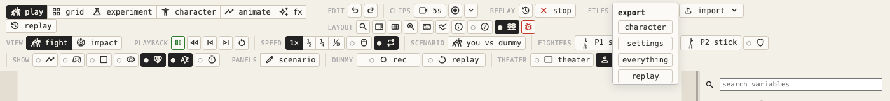
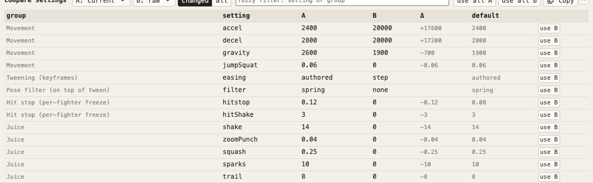
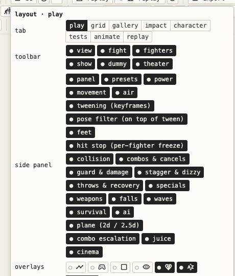
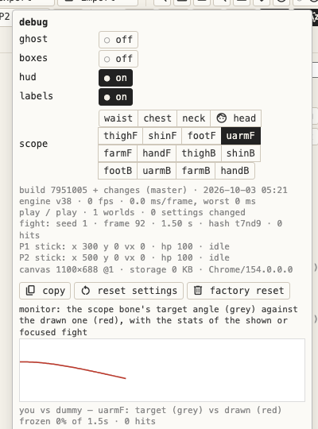
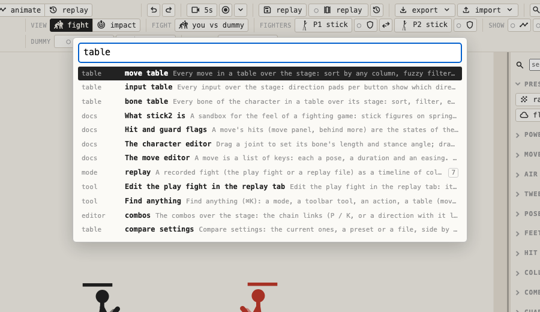

# Interface

[← docs index](README.md)

How to find things: the top bar, search, keys, panels and the in-app docs.

## The top bar

Three rows, the same in every tab:

| Row | What's on it |
|---|---|
| menu bar | the tabs · undo / redo · clip / record · replay save / play · export / import · search, panel, layout, keys, debug, docs, hints, sound |
| transport | pause, rewind, step back, step, restart, speed, scrub, loop (the same in every mode) |
| toolbar | the mode's own tools in labelled groups, in the same order on every tab: view, what you work on (fight, fighters, moves…), the tab's tools, **show** (overlays), **panels** (tables over the stage: click again, × or Esc closes; each tab keeps its own) |

### Export and import

**export** and **import** each open a small menu:

| Item | What's in the file |
|---|---|
| character | the current character |
| settings | every setting changed from its default (the debug views left out) |
| everything | your edited and new characters, the changed settings, your scenarios and your keys, as one JSON file |

- Importing **everything** asks first.
- A broken character in the file loads nothing.
- Settings take any number. Outside a setting's usual range the value box turns amber, far outside it red: the fight may get unstable.
- **import → compare…** compares a settings or everything file with the current settings, without loading it (below).

### Compare settings

The **compare** stage panel (the **panels** group in play and grid, **import → compare…**, or ⌘K **compare settings**) lists two sets of settings side by side.

- **A** and **B** are each the current settings, a preset, or a settings or everything file (only its settings are read).
- Each row is a setting that differs: its group, name (hover for what it does), A, B, B − A for numbers, and the default. **all** lists every setting; the filter finds settings by name or group.
- **use A** / **use B** on a row sets that value, and **use all A** / **use all B** takes a whole side. ⌘Z undoes.
- **copy** puts the differences on the clipboard as text: `- key: A` and `+ key: B` lines.
- To watch the difference, the grid's **compare** kind plays the same fight with A and with B side by side ([modes](modes.md#compare-a-and-b)).

### Layouts

The layout button (four squares) in the menu bar. Each tab remembers its own layout as you go: which toolbar groups and side sections are shown and in what order, which overlays are on, which side sections are folded, which show **more**, whether the side panel is shown, and the sizes (below).

| Row or button | Does |
|---|---|
| toolbar | shows or hides each toolbar group of this tab; drag one onto another to put it before that one, or onto **toolbar** to put it last |
| side panel | shows or hides the whole side panel, and each of its sections; hovering a section heading shows a **×** that hides it too; drag to reorder, as for the toolbar |
| overlays | the same overlay toggles as the toolbar's **show** group |
| use | switches to another named layout; changes are kept in the one in use |
| save as… | copies this layout (every tab) under a new name and uses it |
| reset tab | this tab back to how it starts, in this layout |
| reset all | every tab back to how it starts, in this layout |
| delete | deletes the layout in use (not the default) |

The **show** group in the toolbar holds the overlays, always in this order; each tab has the ones that apply to it:

| Toggle | Draws |
|---|---|
| meter | the frame meter (kept per tab) |
| inputs | your inputs in numpad notation, in play (kept per tab) |
| boxes | the hitboxes and hurtboxes (setting `boxes`) |
| ghost | the keyframe pose as a ghost (setting `ghost`) |
| colours | bones coloured by role, in the editors (kept per tab) |
| hud | health and stun bars, dizzy stars, callouts and the hit counter (setting `hud`) |
| labels | each fight's label and stats line (setting `labels`) |

**Sizes**, kept per tab too:

- Drag the side panel's left edge to set its width (220–560 px); double-click it for the default 300.
- In animate and character, drag the boundary between the editor and the preview to share the stage between them.

⌘K finds **hide toolbar group: …** and **hide side section: …** (or **show**) for the parts of the tab you are on.

### Debug

The debug button (a chart icon) opens the debug popup, in any tab:

- the **ghost**, **boxes**, **hud** and **labels** switches, and the **scope** bone;
- the build, engine version, frame rate, and the shown fight's seed, frame, state hash and fighters, with **copy** for bug reports;
- **reset settings**: every setting back to its default (⌘Z undoes);
- **factory reset**;
- the **monitor**: the scope bone's target angle (grey) against the drawn one (red), with the fight's stats.

## In-app docs

The docs button (ⓘ) in the top bar opens interactive docs over the app. ⌘K finds them too, and so does **docs** in any panel heading's ⓘ.

- **Guide:** topics with live demo fights: pause, step, restart, or **try it in play**. The demos always run on the default settings and the built-in stick, so your edits can't break them; try it uses yours.
- **Reference:** generated from the app's own tables: every setting group with its defaults, move flags and properties, heights, input slots, easing (an animated curve per curve type), and the keyboard as bound now.
- Everything is searchable.

Links:

| Address | Opens |
|---|---|
| `docs.html` | the docs as a page of their own (same as `index.html#docs`) |
| `docs.html#weapons` | one topic |
| `index.html#mode=animate` | a mode |

## Search

### Command palette

⌘K / Ctrl+K, or the magnifier top right. Type to find:

- a mode, a tool on the current toolbar, or a key action;
- a table: the move table, input table and combos (over the character tab there, else in animate), the bone table (in the character tab), compare settings;
- a layout by name, reset layout, reset settings, factory reset;
- a character, a move (opens it in animate) or a setting (searches the settings panel for it; from the gallery it goes to play).

↑ ↓ pick, Enter runs, Esc closes.

### Settings search

The box at the top of the settings panel: fuzzy search over the variable names and groups; plain text also matches tooltips. Esc clears.

## Keys and macros

The **keys** button (⌨) in the top bar shows every key and lets you rebind them, in groups: fight, transport, view, modes, animate, character. Saved in the browser.

**Macros:** one key presses a sequence such as `2, 3, 6P`: numpad directions + P / K, with waits like `0.1`.

### Keys depend on where you are

| Where | Letters belong to | Shortcuts |
|---|---|---|
| a fight (play, grid) | the fighter | take ⇧: ⇧P pause, ⇧N step, ⇧V rewind, ⇧R restart, ⇧H panel, ⇧B boxes, ⇧G ghost; 1–6 switch modes |
| the editors (gallery, impact, character, animate) | shortcuts | the plain key: P, N, R, H, `,` `.` frame, ⇧← ⇧→ key, Enter play, O onion, I aim, Del delete; fight keys and macros do nothing |

- The keys panel heads each group with its context and marks keys that clash within one.
- Keys never reach the fight while a slider or text field has focus.
- A slider's value beside it can be typed: Enter sets it (kept within the slider's range, finer steps allowed), Esc cancels.
- A button clicked with the mouse lets go of focus, so Space doesn't press it again.

## Panels

### Headings

Every heading carries its buttons on the right, in the same place:

- **Things** (character, bones, stance, moves) get their actions always in the same order, with the same icons: new · random · copy · rename · revert · delete · import · export.
- **Groups of variables** get the group buttons (below).
- Panels go from the list to the selected item: character → bones → selected bone → stance → stats → walk; selected move → selected key → character (animate, gallery and tests).
- The settings panel starts with the search, then the presets.
- Settings are saved in the browser as you change them; **reset settings** in the debug popup (or the juicy preset) brings back the defaults.

### Less at once

- Click a heading to fold its section. Folded ones hide their group buttons until hovered.
- Only the section you work in starts open; each one is remembered per mode in the tab's [layout](#layouts).
- Groups show their main variables and keep the rest behind a **more** button (moves: power, knock, launch, stun, damage; bones: len, thick, hurt, lag, stretch; settings: a few per group). A search shows every match, folded or not.
- The character is one button with its drawing, which opens the grid of characters.
- The help line under the view and the frame meter's colour legend show for a few seconds on the first visit to a mode, then only with **hints** (? top right).
- Secondary tools are icon-only buttons with tooltips (transport, panel / keys / hints, the show toggles). Option buttons carry icons too (views, sorts, heights, limbs, targets, presets…).
- Grid's ready-made comparisons sit in one **tests** menu; the input table shows its pads with the full table behind **details**.

### Variable groups

Every group of variables (settings, the selected bone, the move, the selected key) has buttons for all of them at once:

| Button | Does |
|---|---|
| dice | randomize |
| reset | back to defaults (the built-in values) |
| ▲ / ▼ | empower / diminish |
| flask | experiment with them in a grid (settings and bones) |

- Grid experiments (breed, attacks, body) give each cell a distinct value of every varied variable, spread evenly over the range. **exaggerate** ×2 / ×4 makes the differences stand out.
- Every variable's name is a link (dotted underline, a flask on hover). Click it to experiment with that one variable: settings sweep it across the grid; bone properties, stats and walk & idle open nine bodies varying only it.
- Every setting has a hover tooltip; each group's ⓘ explains it and lists its keys.

## Time

- **Pause** shows a large PAUSED sign over the preview.
- **Scrub** (transport, M): move the mouse left / right to set the time in any view. The seeded fights are re-simulated to that moment.
- **Undo** (⌘Z, ⇧⌘Z redo): sliders, presets, group buttons and grid picks, on the same stack as character edits. Clicking a sweep or breed cell also applies its values (Shift+click only focuses).

## Clips

Save what you watch as an animated GIF or a WebM video.

| Control | What it does |
|---|---|
| clip (⇧X in a fight, X in the editors) | saves the last seconds |
| record (⇧E / E) | films until you press it again (at most 20 s), then saves |
| ▾ | format (GIF / WebM), length (3, 5, 10 s), width (320, 480, 720 px), frame rate (15, 30, 50), aspect (the view's, 16:9, 4:3, 1:1, 9:16) and fit (crop or letterbox) |

- It films the part of the view you watch: the fight in play, the cell under the mouse in the grid, gallery, impact and the body experiment, the preview in animate and character, the watched fight in tests.
- Moving the mouse to another cell starts the buffer again. A recording stays on the cell it started on.
- Paused time is left out. Slow motion stays slow.
- A GIF loops by itself and has 255 colours. A WebM is smaller and keeps every colour, but saving it takes as long as the clip.

## Sound

Whooshes, hits, thuds and blocks, synthesized live with WebAudio (no sound files) and panned by where they happen.

- Only in the live fight and the animate preview; rewinds and replays stay silent.
- The sound toggle in the top bar mutes them.

## Factory reset

⌘K **factory reset**, or the debug popup. It asks, then deletes everything stick2 keeps in the browser (edited and custom characters, settings, scenarios, keys and macros, layout and hints) and reloads as on a first visit.

Export **everything** first to keep your work.
