# Modes

[← docs index](README.md)

The top bar has four tabs: **play**, **grid**, **character** and **animate**. Some of them have more views inside (impact, gallery, tests), picked under **view** in the toolbar.

| Tab | Views | What it's for |
|---|---|---|
| [play](#play) | fight · [impact](#impact) | fight, train, watch hit reactions |
| [grid](#grid) | | compare one fight across many settings |
| [character](#character) | | build a body |
| [animate](#animate) | [gallery](#gallery) · [tests](#tests) | build moves, check them all |

## Play

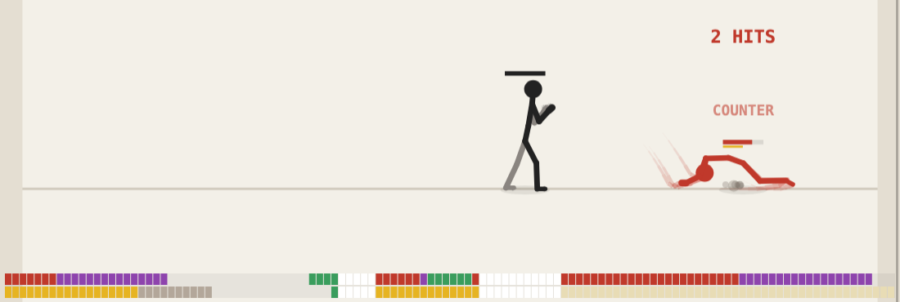

One fight on the full stage.

### Scenarios

**fight** in the toolbar opens the scenario picker:

- Scenarios are grouped by who fights: you, the engine AI, a dummy.
- The scripted tests are grouped by topic: chains, juggles & falls, guard & counters, specials, movement, weapons.
- Type in the filter box to narrow the list; Enter picks the first one left.

### My scenarios

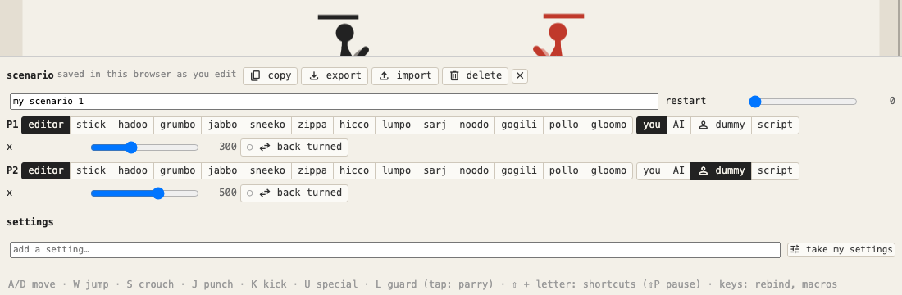

**new scenario** in the picker copies the current scenario into a builder over the stage. **scenario** in the **panels** group (shown for your own scenarios) opens and closes it.

- **P1 and P2** each get a character (or the one being edited), a controller, a start x and back turned.
- **Controllers:** you, AI, dummy, or a script like `0.2, 2P, hold up 0.2, K`.
- **restart** sets how often the fight starts over.
- **settings:** add one by name, or **take my settings** to bring every setting you changed from the defaults.
- Saved in this browser as you edit, and listed first in the picker.
- copy, export / import as JSON, delete.

### Fighter select

The **fighters** group in the toolbar has one button per fighter: P1, P2, and P3, P4… in 2 v 2, free-for-all and multi-dummy fights.

- Click one to pick any character from a grid of cards.
- By default a fighter follows the character being edited. Unset extra fighters fight as P2.
- **random** picks a random character; **mirror** gives P2 the same one as P1; ⇄ swaps P1 and P2.
- A scenario that names its own characters keeps them.

### The AI

The AI cancels chains into rush and spin, stomps a downed fighter and meets jumps with rising.

**aiLevel** (AI settings) sets how often it decides and guards, how fast it reacts, and its chance to break a throw, tech a landing, anti-air and juggle. A scenario can set its own.

| aiLevel | breaks a throw |
|---|---|
| easy | about 1 in 10 |
| normal | about 1 in 3 |
| hard | about 3 in 5 |
| expert | most of the time |

### Endless waves

Pick **endless waves** in the fight picker (or **ai vs waves** to watch).

- When every enemy is down, the knocked-out ones leave and the next wave runs in from both edges.
- The **waves** group in the toolbar (or the Waves settings) picks the size: one, pairs, growing (wave *n* brings *n*, at most 5) or horde (4).
- **mixed** sends random built-in characters instead of copies of the opponent.
- Clearing a wave gives back **waveHeal** of your health. If you're K.O.'d, you start over at wave 1.
- The wave and the enemies down are shown at the top.

### Training

Turn these on under **show**:

- **Frame meter:** startup, active, recovery, hitstun and hit stop, frame by frame.
- **Input display:** your inputs in numpad notation.

The **dummy** group records your inputs and lets the dummy replay them.

**Rewind:** ⇧V goes one second back, C one frame back. It restores the last checkpoint before that point and replays the inputs from there, exactly as before, then pauses. Checkpoints are kept once a second, thinned to one every 10 s past the last minute.

### Replays

Both replay buttons are in the menu bar, next to undo / redo.

- **replay** (save icon) downloads the play fight as a replay file: inputs, seed, settings, characters, and a state checksum every second.
- **replay** (film icon) plays one back, from any tab (it switches to play).
- A file from another engine version asks first. The top line then shows the version and where the fight goes out of sync.

## Impact

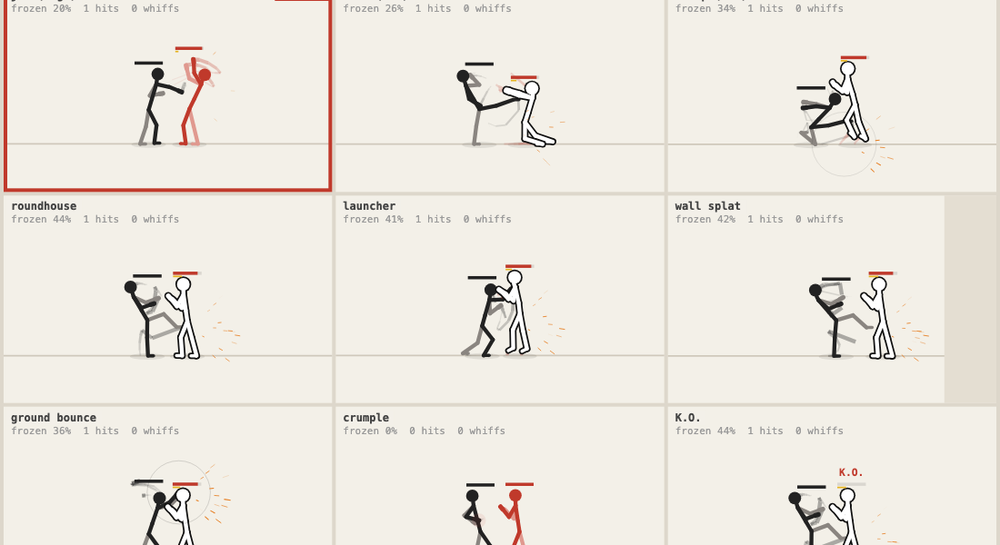

**play → view impact** (key 6). Hit reactions and falls side by side.

### Hits

Nine bodies, each struck by the stick fighter: jab, kick, sweep, roundhouse, launcher, wall splat, ground bounce, crumple and K.O.

- **Drag on a body** to strike it at that point. The drag's direction and length are the blow; a long one knocks down.
- **Click a body** for a medium blow.
- **falls:** ragdoll or pose, to compare the two.
- **no attacker** hides the stick fighter. Its blows still land the same way and the camera frames the struck body, so only the reaction is on screen and drags reach the body unobstructed.

### Ragdoll

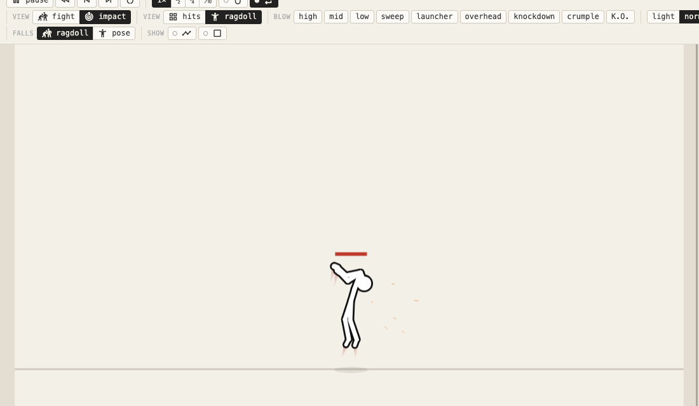

**ragdoll** (next to **hits**, in the **kind** group) is one big body alone.

- The **blow** buttons strike it: high, mid, low, sweep, launcher, overhead, knockdown, crumple, K.O. Each is a stick move's hit without damage, on the bone at that height.
- **light / normal / heavy** set how hard; **front / back** where from.
- **stand up** puts it back on its feet.
- Drags still strike it.

The same body and buttons are in the character editor as the **impact** preview.

## Grid

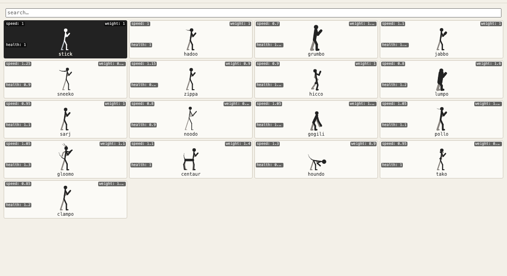

A 3 × 3 sweep of any setting (or X × Y). Every cell replays the same seeded fight, so the only difference is the setting.

### Breed

**breed** gives the cells random values of the settings you pick, around a parent. Click the best cell to breed around it.

### Attacks

**attacks** generates random attacks for the current character (IK-posed on any limb end) and breeds them.

- Hover a cell for its own **save** (as a move) and **edit** (in animate) buttons. Saving the same attack twice keeps one name.
- Pick the striking **limb** (any, arm, leg, head, tail…) and **height** (any, high, mid, low) of new attacks.
- **pose → animation:** pick a preset pose or another stance to strike into. The limb that moves most strikes, after an anticipation the other way. The character editor's pose → animation button opens the grid on a pose.

### Testing in the grid

- 1, 3 or 5 seeds per cell, with averaged hits, whiffs and frozen %; sort cells by a metric.
- **collision test:** every hitTest mode × three fights.
- **window edge test:** lastFrame off / on × presses on the tech window's last frame and one frame inside. The edge break and tech only count with it on.
- Gallery moves can hit a dummy, whiff, or face the AI.

## Character

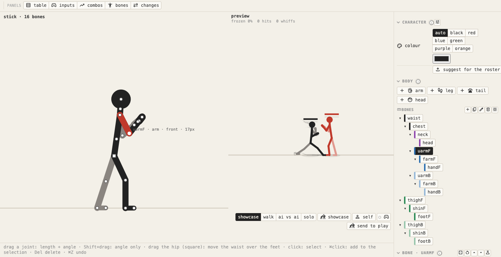

Build a body by dragging it.

### The skeleton

- **Drag a joint** to set its bone's length and stance angle.
- **Drag the hip** (the square handle where the waist and legs start) to move the waist over the feet. The legs bend, the feet stay.
- **Select several bones:** ⌘/Ctrl+click a joint or a name in the tree, Shift+click in the tree. Any property, role, side, shape, limit or stance angle you change goes to all of them.
- **Add limbs** by role: arms, legs, tails, heads, joints.

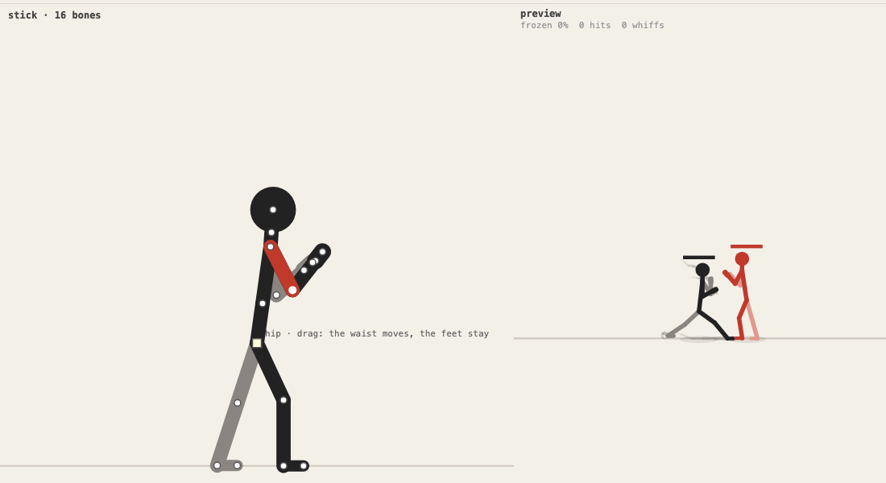

### Bone properties

Stretch, follow-through, stiffness and secondary motion:

- **react:** how hard blows jolt the bone.
- **sway:** idle drift.
- **dangle:** hangs like a rope. With the dangle and dangleDrag settings, tails, sneeko's scarf, hadoo's headband and hicco's beard and gourd droop with gravity, stream back from a run and lift in a fall.

### Preview

A live fight next to the editor: **showcase**, **walk**, **vs ai**, or **impact** (the body alone with the [ragdoll](#ragdoll) blow buttons, to see it fall).

### Bone table

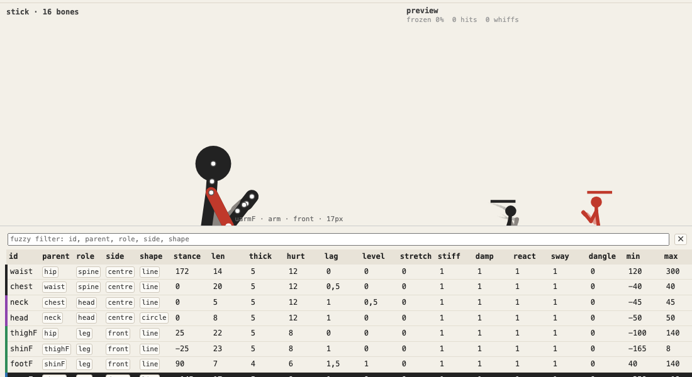

The **panels** group → **bones** puts every bone in a table over the stage: id, parent, role, side, shape, stance angle, every bone property, limits, lock.

- Click a header to sort; a third click goes back to the bone order.
- Drag a bone's id onto another to move it before that one. Inside front, centre and back, earlier bones draw underneath.
- Click a bone's parent to hang it (and what hangs from it) from another bone or the hip.
- The fuzzy filter matches id, parent, role, side and shape.
- Edit values in place. An edit in a selected row goes to every selected bone.
- Click a row to select it; ⌘/Ctrl/Shift+click adds it to the selection.

### Experiment

**experiment** breeds a 3 × 3 grid of body variations around the cell you click. With **limbs** on, variations also add, drop or extend limbs.

### Moves

The **panels** group in the toolbar (here and in animate) opens the move table, the inputs and the combos over the stage; here also the **bones** table. Click it again, × or Esc to close; each tab keeps its own open panel. A move clicked in them (or picked from **edit** in the **moves** group; in animate, from the **move** group) opens in animate. See [Editing](editing.md).

## Animate

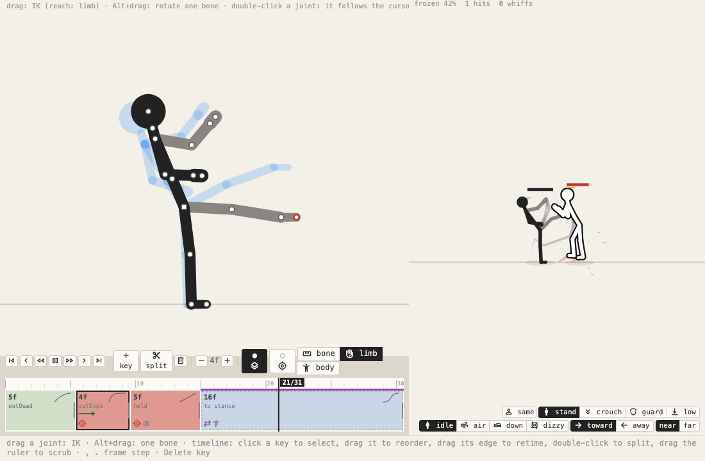

Pose keyframes, retime them, and watch the move against a target.

### Posing

- **Drag a joint** to pose it (IK). Alt rotates one bone.
- Every joint moves unless locked. Joint limits only steer the solve: a drag they would stop goes past them.
- **The hip** (square handle) moves the body and bends the legs so the feet stay.
- **reach** sets how much a drag moves: **bone**, **limb** (a hand bends the arm) or **body** (everything the joint hangs from, so the torso leans after the hand).
- **aim:** the striking limb follows the cursor. Double-click any joint to make that one follow instead.
- **mirror** swaps the front and back limbs of a key.
- The cursor shows what a drag will do.

### The timeline

Keys sit on a 60 fps timeline. The transport, key and onion / aim buttons are right above it.

Each key block shows:

| Look | Meaning |
|---|---|
| green / red / blue | startup / active / recovery |
| hatching | invincible, unblockable or armor |
| a curve | its easing |
| an arrow | its lunge |
| icons | its flags |
| dashed | it returns to the stance |

- Drag a key's edge to retime it, drag the key to reorder.
- Double-click to split a key; Delete removes it.

### Key properties

- Easing, active frames, lunge and hit properties.
- **events:** the hit spark (hit, heavy, slash, blunt, none), a sound as the key is reached, after-images while it plays, screen shake. Effects only: the fight plays out the same. A key with events shows a spark icon.
- **Striking bones:** limb, head and tail ends as buttons, any bone from the list, or Shift+click a joint. Shift+click a button or ⌘/Ctrl+Shift+click a joint to add or remove one, so several limbs strike at once; whichever lands counts, once per target.

### Preview target

A live preview with springs and hit stop, against a **target**:

- any character
- standing, crouching, guarding or low guard
- idle, in the air, lying or dizzy
- facing toward or away

### The move group

The toolbar's **move** group holds the move being edited:

- **‹ ›** step to the previous or next move.
- **The move's name** opens the picker (below), with the filter ready to type in.
- **copy** and **delete** (copies only), and **+** for a keyframed idle or walk loop or a movement layer of the stance.
- **The stance**, when the character has more than one (stances are made in the character tab).

The side panel holds the move's settings, then the key's, then the character (folded). The gallery and tests views show the same panel; the fight settings are in play, grid and impact.

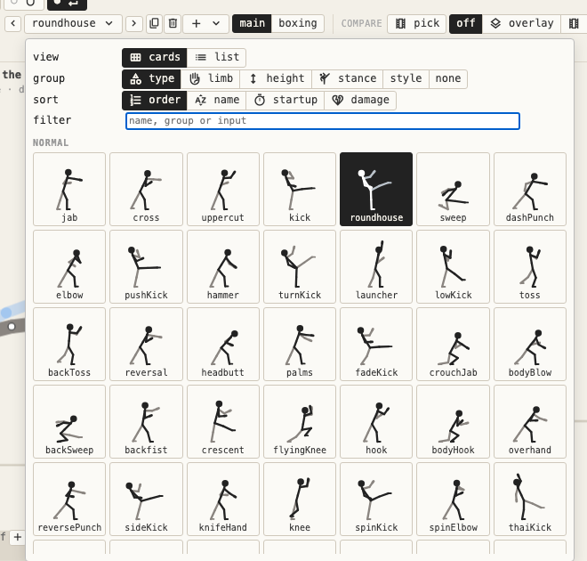

The picker shows the moves as:

- **cards** (a drawing of each move's strike; hover plays it) or **list** (just names); the choice is kept in the layout.
- **group** by type, striking limb, height, stance or **fighting style**: boxing, karate, muay thai, capoeira, kung fu, taekwondo, wrestling; the rest are basic.
- **sort** by order, name, startup or damage.
- **filter** by name, group or input.

### Compare

**compare** (toolbar) picks a second move:

- **overlay** draws it over the edited one in amber at the same moment, feet on the same ground.
- **strip** shows both as filmstrips: a frame every few frames on one time scale, tinted by phase, with their frame data. The playhead's frame is outlined; click a frame to go there.

The move table, input table and combos are on the [Editing](editing.md) page.

## Gallery

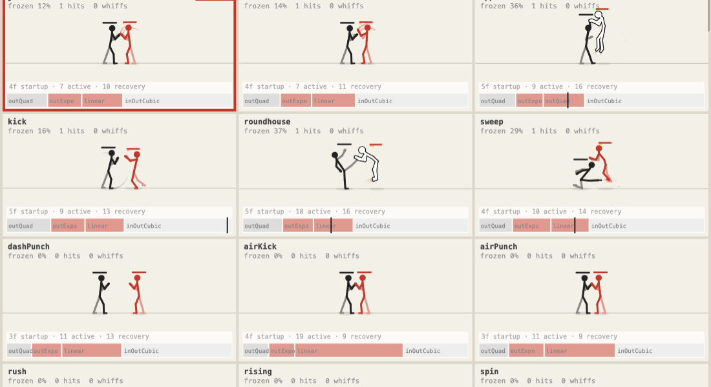

**animate → view gallery.** Every move looping, then every movement.

- **Moves:** attacks first, then specials, rolls, taunts, weapon moves… Each with its keyframe timeline and frame data (startup, active, recovery, advantage on hit).
- **Movements**, each played by a short script with its speed and height plot: idle, walk, back walk, run, dash, back dash, crouch, jump, jump forward, flip, air dash, air dodge, guard, low guard, turn, hit reaction, blockstun, knockdown & getup, launched, dizzy. Hover a cell for what it shows.
- Click a move's cell to focus it; the side panel then edits that move.
- Cells keep a readable size and scroll with the mouse wheel.
- Only the cells on screen are built, run and drawn. A cell scrolled away drops its fight and starts afresh when it comes back, so a long move list stays light.

## Tests

**animate → view tests.** The move test matrix: one move (or all) played against a target in every state.

**Columns:** stand, crouch, guard, low guard, air, down, dizzy × facing or back turned × near or far. **against:** the same character, or all of them.

Each cell shows **H** hit, **B** blocked or **·** whiff, and is checked:

- It hits or is blocked as its height and the target's guard say: guard blocks from the front, a high passes over a crouch, only otg hits the floor.
- Its own setup connects: standing, facing, near, at the move's **range** (45 px unset; a move property in the move panel).
- Both fighters return to neutral.
- Nothing becomes NaN or leaves the stage.

Using it:

- Red cells fail; hover for why. **failing only** (in the **rows** group) hides the rest.
- Click a cell to watch it looping over the table; the side panel then edits its move. **open in animate** edits the move with that exact target (the preview target has near / far too).
- My scenarios are played through as cases too (NaN, stage, stuck 5 s).
- Cells run in the background, a few per frame, and rerun when the character or a setting changes.
