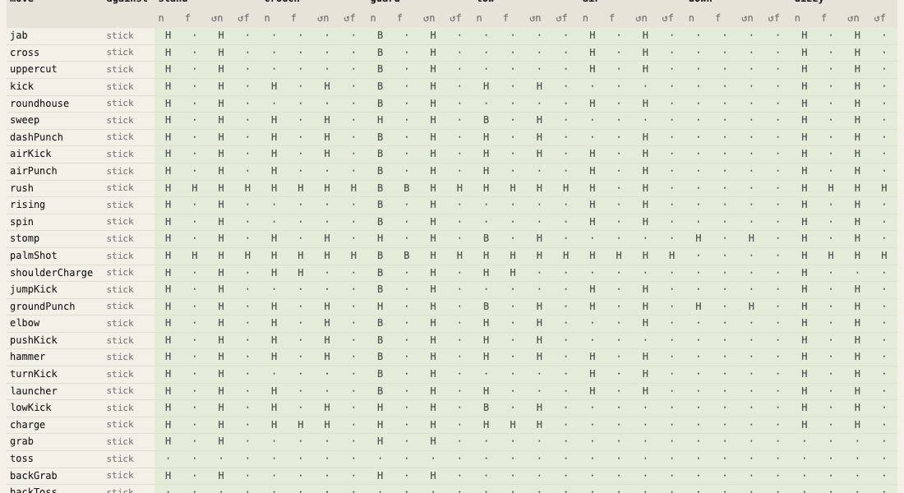

# Testing

[← docs index](README.md)

The engine tests run in Node with no dependencies. A headless Chrome test covers the UI.

## Running the tests

| Command | What it does |
|---|---|
| `npm test` | engine unit tests and the scenario / character regression snapshots, in Node (also writes the build info first) |
| `npm run test:update` | rewrites the snapshots after an intended change |
| `npm run test:browser` | loads the page in headless Chrome and goes through every mode, character and stance, checking for errors |
| `npm run test:all` | `npm test`, then the browser test |
| `npm run test:matrix` | every move of every character in the full move matrix (`MATRIX=full`), before a release |
| `npm run coverage` | the Node tests with V8 coverage of the engine |
| `npm run coverage:browser` | the browser test with Chrome's coverage of every file in `src/` |
| `npm run build-info` | writes `src/build.js` only |

## Snapshots and replays

- `tests/snapshots/` holds the scenario and character regression snapshots. After an intended change, `npm run test:update` rewrites them.
- `tests/fixtures/replays.json` holds recorded fights that must still play out identically. Any change to the simulation fails it.

After a change to the simulation:

1. Bump `ENGINE_VERSION` in core.js. Old replay files are then flagged as from another version.
2. Re-record with `npm run test:update`.

## Build info and the debug popup


`npm test` also runs `tools/build-info.js` (or `npm run build-info`). It writes `src/build.js`: git commit, branch, date and uncommitted changes. The file is ignored by git.

The build info is shown in the debug popup (the chart button in the menu bar), next to the engine version, frame rate and the focused fight's seed, frame, state hash and fighters. Its copy button copies all of it for bug reports.

## Coverage

`npm run coverage` runs the Node tests with V8 coverage of the engine and prints line / branch / function coverage per file.

- Covered: the engine in `src/` (core, rig, fighter, world, brain), loaded into a vm context by `tests/load.js` under their real paths.
- The UI modules need the DOM, so the browser test covers them instead.

`npm run coverage:browser` (`COVERAGE=1 node tests/browser.js`) runs the browser test with Chrome's own coverage, over DevTools, and prints line and function coverage for every file in `src/`, lowest first.

- A line counts as run when any code on it ran, so long one-line functions look fully covered. The function column is the stricter one.
- Engine files show less here than under `npm run coverage`: the browser test only plays a few frames of each mode.

## The suites

| File | What it checks |
|---|---|
| `tests/engine.test.js` | engine units: guard, throws, specials, juggles, weapons, rewind, replays of each feature |
| `tests/scenarios.test.js` | every scripted scenario and every character pair, played out and compared with `tests/snapshots/` |
| `tests/replay.test.js` | the recorded fights in `tests/fixtures/replays.json` replay frame-exact (checksums every 60 frames name the first frame that differs) |
| `tests/roster.test.js` | the built-in characters: signature moves bound and playable, projectiles, stances |
| `tests/stances.test.js` | stance bodies: compiled once (with weapons too), the switch swaps the body and keeps the move, an empty body fights the same, a fight with stance bodies replays in sync; requirements (health, where, once, cooldown, min / max time, exit on hit, own moves); an auto morph finishes in its frames, transition moves play |
| `tests/render.test.js` | every scenario renders into a stub canvas with every overlay on, and drawing never changes the fight |
| `tests/data.test.js` | data validation: settings defaults within their range / options, presets, power presets and scenario settings use real settings with fitting values, scenario characters exist; bones (unique, parents exist, limits); moves (heights, hits, striking bones, posed bones, durations, chains, throws and counters name real moves); every bound input and stance key |
| `tests/boundary.test.js` | every timing window one frame inside its edge, on it and one past it (N-1, N, N+1) at a few sizes: parry (N frames before the blow), just guard, throw break and landing tech (N+1: the press on the edge frame counts; with lastFrame off, N), air recover (only once airRecover has passed), and the juggle pool (a hit costing 2 passes with 1, lands with 2 and 3) |
| `tests/matrix.test.js` | the Tests view's move matrix (`src/checks.js`) with what must hold in every cell: the move starts, nothing becomes NaN, both fighters return to neutral, nobody leaves the stage; against its own character also hit / block / whiff as expected; each move (the stick's library and every fighter's own) gets 2 cells, column and opponent picked by the seed |
| `tests/fuzz.test.js` | 25 AI fights (10 s each) between random characters with 8 random settings each (any value the side panel allows): nothing throws, nothing becomes NaN, health stays within 0 … its maximum, nobody leaves the stage |
| `tests/determinism.test.js` | the same seed plays the same AI fight frame for frame (also in a fresh engine); another seed plays another |
| `tests/centaur.js` | a quadruped test character (not in the roster) for bones a biped never has; `run(require('./centaur'))` adds it |
| `tests/browser.js` | headless Chrome: every mode, character and stance, no errors |
| `tests/browser-coverage.js` | the browser test under Chrome's coverage (`npm run coverage:browser`) |

A data check lists every problem it finds, one line each (`stick.jab: punch chains into nothing, not a move`), so one run shows all of them.

## Seeds

The engine has no clock and no hidden randomness:

- Time comes in as each frame's `dt`.
- All chance (the AI, sparks, random weapons) comes from the world's seeded generator: `new World(scenario, settings, seed, chars)`.
- The snapshot, replay and unit tests use fixed seeds.

The randomized tests share one seed from `tests/seed.js`, printed on every run (`# seed 1`):

| Command | Seed |
|---|---|
| `npm test` | 1, the same every run |
| `SEED=42 npm test` | 42: rerun a failure with the seed it names |
| `SEED=random npm test` | a fresh one each run (and each test file: `# seed 1460372106 for fuzz.test.js`), to explore; it is printed, so a failure can be replayed |
| `FUZZ=500 node --test tests/fuzz.test.js` | 500 fuzz fights instead of 25 (seeds SEED … SEED + 499) |

## The move matrix



The same matrix as the [Tests view](modes.md#tests), run in Node.

| Run | Cells | Time |
|---|---|---|
| `npm test` | each move in 2 cells picked by the seed, about 340 | 5 s |
| `npm run test:matrix` (`MATRIX=full`) | every move of every character in all 28 columns against itself, about 36,000 | 8 minutes |

- `SEED=random npm test` tries other cells.
- Run the full matrix before a release.
- A failure lists each bad cell (`stick.jab vs sneeko, target guard back turned near: a position became NaN`) with the command that reruns it. The Tests view (animate tab) shows the same cell playing.

### What is checked

- **Against its own character:** a cell must also hit, be blocked or whiff as the Tests view expects. Its own setup (standing and facing at the move's range) must connect.
- **Against other characters:** only the invariants. Some moves still miss a target of another size there.

### Known misses

Known bugs, visible in the Tests view with against: all:

- grumbo's overhand misses almost everyone.
- Highs from grumbo, noodo and gloomo (backfist, hook, chainPunch, guardCancel, headbutt, palms) pass over the short gogili.
- hadoo's tatsu, jabbo's buffaloHead, zippa's birdKick, sarj's kneeBazooka and gogili's stomp miss one to three of the others.

## Fuzzing

Fuzz case *i* plays with seed `SEED + i` and is made from that seed alone (characters, scenario, settings). So one case replays by itself:

```
SEED=10 FUZZ=1 node --test tests/fuzz.test.js
```

A failing case is shrunk before it is reported:

- Each setting is dropped while the fight still fails.
- It plays only up to the failing frame.

The report shows the seed, what broke and on which frame, the few settings that cause it, the replay command and the engine call that rebuilds the fight. This one comes from a fault planted to try the shrinker:

```
seed 10: frame 75, gogili: a position, speed or health became NaN
  settings: {"gravity":4000}
  replay: SEED=10 FUZZ=1 node --test tests/fuzz.test.js
  or in the engine: new World(SCENARIOS['ai vs ai'], {"gravity":4000}, 10, [CHARS.gogili, CHARS.gloomo])
```
